# F5

The F5 Orchestrator allows for the remote management of F5 Stores. Discovery, Inventory, and Management functions are supported.

#### Integration status: Production - Ready for use in production environments.

## About the Keyfactor Universal Orchestrator Capability

This repository contains a Universal Orchestrator Capability which is a plugin to the Keyfactor Universal Orchestrator. Within the Keyfactor Platform, Orchestrators are used to manage “certificate stores” &mdash; collections of certificates and roots of trust that are found within and used by various applications.

The Universal Orchestrator is part of the Keyfactor software distribution and is available via the Keyfactor customer portal. For general instructions on installing Capabilities, see the “Keyfactor Command Orchestrator Installation and Configuration Guide” section of the Keyfactor documentation. For configuration details of this specific Capability, see below in this readme.

The Universal Orchestrator is the successor to the Windows Orchestrator. This Capability plugin only works with the Universal Orchestrator and does not work with the Windows Orchestrator.

## Support for F5

F5 is supported by Keyfactor for Keyfactor customers. If you have a support issue, please open a support ticket with your Keyfactor representative.

###### To report a problem or suggest a new feature, use the **[Issues](../../issues)** tab. If you want to contribute actual bug fixes or proposed enhancements, use the **[Pull requests](../../pulls)** tab.
___

---

## Keyfactor Version Supported

The minimum version of the Keyfactor Universal Orchestrator Framework needed to run this version of the extension is 10.1

## Platform Specific Notes

The Keyfactor Universal Orchestrator may be installed on either Windows or Linux based platforms. The certificate operations supported by a capability may vary based what platform the capability is installed on. The table below indicates what capabilities are supported based on which platform the encompassing Universal Orchestrator is running.
| Operation | Win | Linux |
|-----|-----|------|
|Supports Management Add|&check; |&check; |
|Supports Management Remove|&check; |&check; |
|Supports Create Store|  |  |
|Supports Discovery|&check; |&check; |
|Supports Renrollment|  |  |
|Supports Inventory|&check; |&check; |

## PAM Integration

This orchestrator extension has the ability to connect to a variety of supported PAM providers to allow for the retrieval of various client hosted secrets right from the orchestrator server itself.  This eliminates the need to set up the PAM integration on Keyfactor Command which may be in an environment that the client does not want to have access to their PAM provider.

The secrets that this orchestrator extension supports for use with a PAM Provider are:

|Name|Description|
|----|-----------|
|ServerUsername|The user id that will be used to authenticate to the F5 installation|
|ServerPassword|The password that will be used to authenticate to the F5 installation|
  

It is not necessary to use a PAM Provider for all of the secrets available above. If a PAM Provider should not be used, simply enter in the actual value to be used, as normal.

If a PAM Provider will be used for one of the fields above, start by referencing the [Keyfactor Integration Catalog](https://keyfactor.github.io/integrations-catalog/content/pam). The GitHub repo for the PAM Provider to be used contains important information such as the format of the `json` needed. What follows is an example but does not reflect the `json` values for all PAM Providers as they have different "instance" and "initialization" parameter names and values.

### Example PAM Provider Setup

To use a PAM Provider to resolve a field, in this example the __Server Password__ will be resolved by the `Hashicorp-Vault` provider, first install the PAM Provider extension from the [Keyfactor Integration Catalog](https://keyfactor.github.io/integrations-catalog/content/pam) on the Universal Orchestrator.

Next, complete configuration of the PAM Provider on the UO by editing the `manifest.json` of the __PAM Provider__ (e.g. located at extensions/Hashicorp-Vault/manifest.json). The "initialization" parameters need to be entered here:

~~~ json
  "Keyfactor:PAMProviders:Hashicorp-Vault:InitializationInfo": {
    "Host": "http://127.0.0.1:8200",
    "Path": "v1/secret/data",
    "Token": "xxxxxx"
  }
~~~

After these values are entered, the Orchestrator needs to be restarted to pick up the configuration. Now the PAM Provider can be used on other Orchestrator Extensions.

### Use the PAM Provider
With the PAM Provider configured as an extenion on the UO, a `json` object can be passed instead of an actual value to resolve the field with a PAM Provider. Consult the [Keyfactor Integration Catalog](https://keyfactor.github.io/integrations-catalog/content/pam) for the specific format of the `json` object.

To have the __Server Password__ field resolved by the `Hashicorp-Vault` provider, the corresponding `json` object from the `Hashicorp-Vault` extension needs to be copied and filed in with the correct information:

~~~ json
{"Secret":"my-kv-secret","Key":"myServerPassword"}
~~~

This text would be entered in as the value for the __Server Password__, instead of entering in the actual password. The Orchestrator will attempt to use the PAM Provider to retrieve the __Server Password__. If PAM should not be used, just directly enter in the value for the field.

---

## Use Cases

The F5 Orchestrator supports three different types of certificates stores with the capabilities for each below:

- CA Bundles
  - Discovery
  - Inventory
  - Management (Add)
- Web Server Device Certificates
  - Inventory
  - Management (Add, but replacement/renewal of existing certificate only) 
- SSL Certificates
  - Discovery
  - Inventory
  - Management (Add)

## Versioning

The version number of a the F5 Orchestrator can be verified by right clicking on the F5Orchestrator.dll file, selecting Properties, and then clicking on the Details tab.

## Keyfactor Version Supported

The F5 Orchestrator has been tested using Keyfactor Command version 9.4 and the Keyfactor Universal Orchestrator version 9.5.  However, this should be compatible with any Keyfactor versions 9.x and above.

## F5 Orchestrator Installation

1. In the Keyfactor Orchestrator installation folder (by convention usually C:\Program Files\Keyfactor\Keyfactor Orchestrator), find the "extensions" folder. Underneath that, create a new folder for each F5 Orchestrator certificate store type you wish to manage.  Suggested names for each are below:
    - F5-CA-REST (for management of CA Bundles)
    - F5-WS-REST (for management of Web Server Certificates)
    - F5-SL-REST (for management of SSL Certificates)
3. Download the latest version of the F5 Orchestrator from [GitHub](https://github.com/Keyfactor/f5-rest-orchestrator).
4. Copy the contents of the download installation zip file to each of the folders created in step 1.
5. (Optional) If you decided to name any of the folders in step 1 to something different than the suggested names, you will need to edit the manifest.json file in each of the folders.  For each section change {folder name} in "CertStores.{folder name}.*Capability*" to the folder name you used for each store type.

## F5 Orchestrator Configuration

**1. In Keyfactor Command, if any of the aforementioned certificate store types do not already exist, create a new certificate store type for each of the 3 that you wish to manage by navigating to Settings (the "gear" icon in the top right) => Certificate Store Types.**

**<u>CA Bundles:</u>**

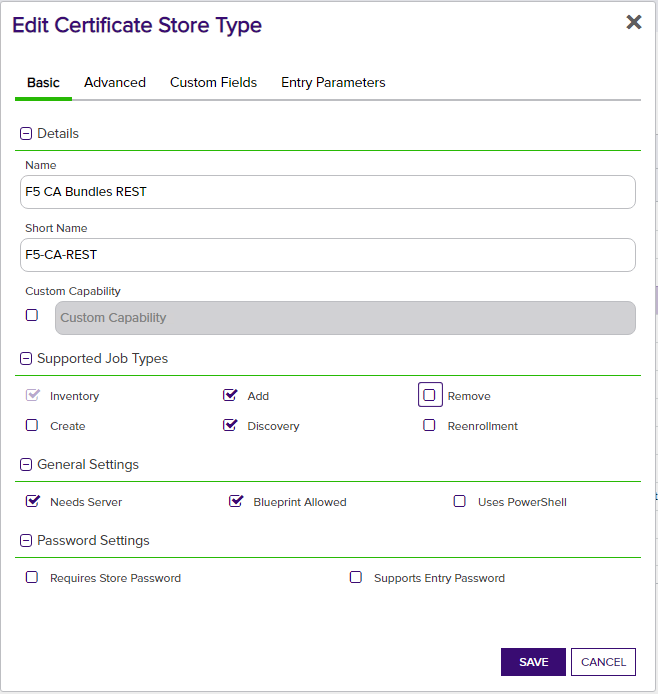
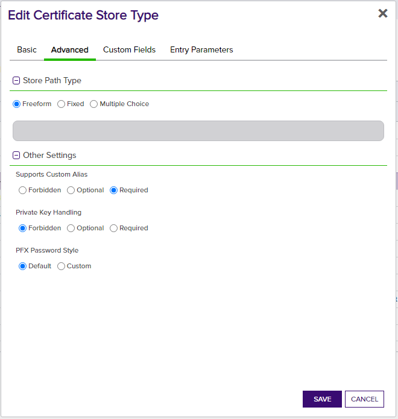

**<u>Web Server Certificates</u>**

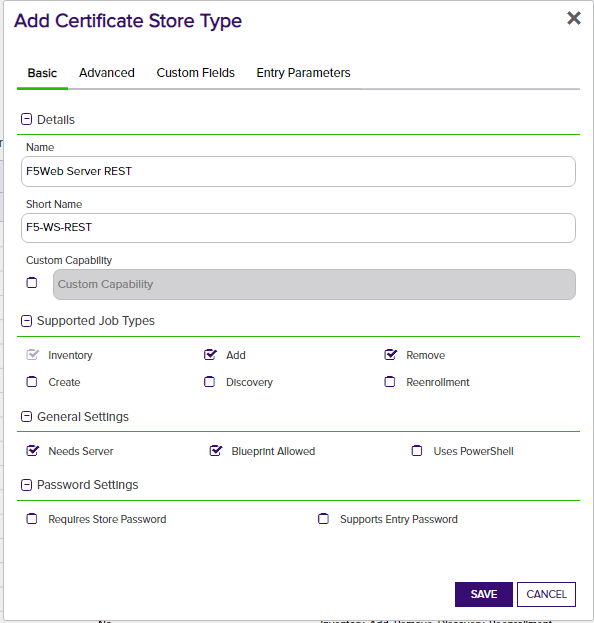
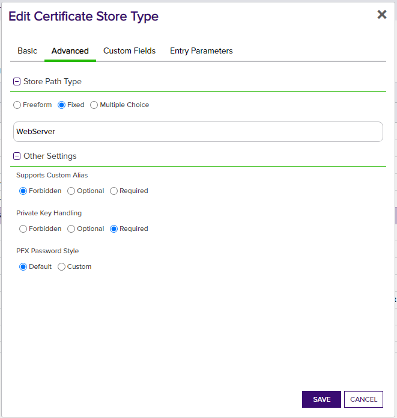

**<u>SSL Certificates</u>**

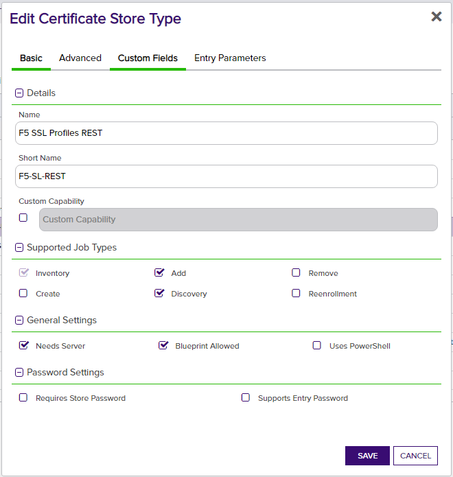
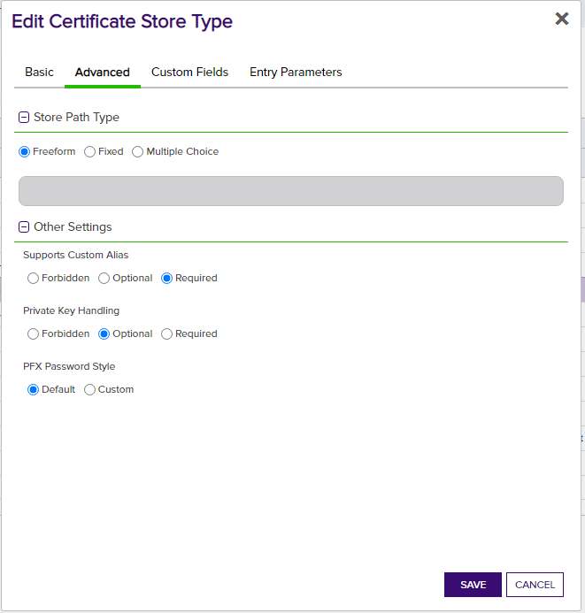

- **Name** – Required. The display name of the new Certificate Store Type
- **Short Name** – Required. This value ***must match*** the folder name for this store type under the "extensions" folder in the install path.
- **Custom Capability** - Leave unchecked
- **Supported Job Types** – Select Inventory and Add for all 3 types, and Discovery for CA Bundles and SSL Certificates.
- **General Settings** - Select Needs Server.  Leave Uses PowerShell unchecked.  Select Blueprint Allowed if you plan to use blueprinting.
- **Password Settings** - Leave both options unchecked
- **All selections on Advanced tab** - Set the values on this tab ***exactly*** as they are shown in the above screen prints for each applicable store type.

The Custom Fields tab contains 6 custom store parameters.  The set up is consistent across store types, and should look as follows:

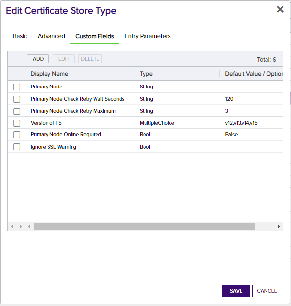   
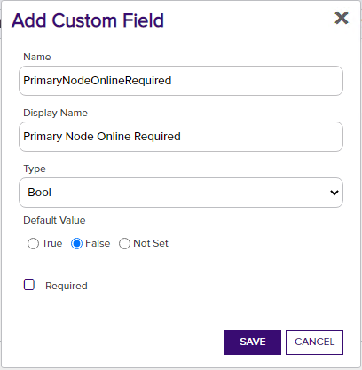   
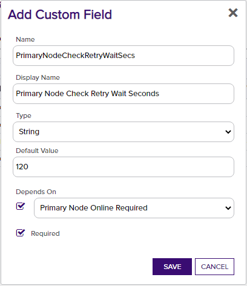   
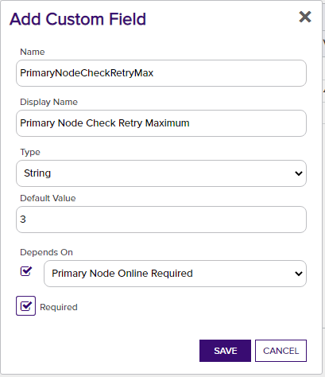   
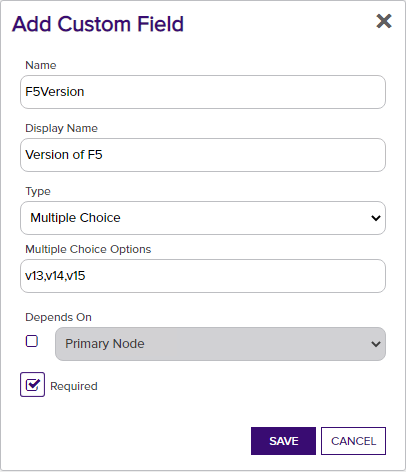   
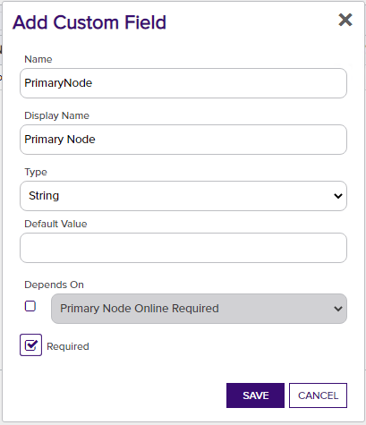   
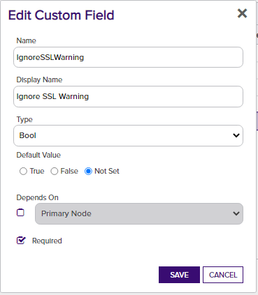   

If any or all of the 3 certificate store types were already set up on installation of Keyfactor, you may only need to add Primary Node Online Required and Ignore SSL Warning.  These parameters, however, are optional and only necessary if needed to be set to true.  Please see the descriptions below in "2a. Create a F5 Certificate Store wihin Keyfactor Command.

**2a. Create a F5 Certificate Store within Keyfactor Command**  
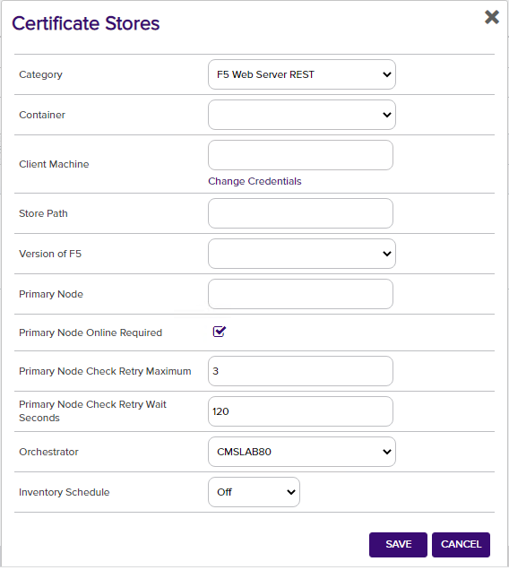  

If you choose to manually create a F5 store In Keyfactor Command rather than running a Discovery job (Step 2b) to automatically find the store, you can navigate to Certificate Locations =\> Certificate Stores within Keyfactor Command to add the store. Below are the values that should be entered.

- **Category** – Required.  One of the 3 F5 store types - F5 Web Server REST, F5 CA Bundles REST, or F5 SSL Profiles REST (your configured names may be different based on what you entered when creating the certificate store types in Step 1).

- **Container** – Optional.  Select a container if utilized.

- **Client Machine & Credentials** – Required.  The server name or IP Address and login credentials for the F5 device.  The credentials for server login can be any of:
  
  - UserId/Password
  
  - PAM provider information to pass the UserId/Password or UserId/SSH private key credentials
    
  When entering the credentials, UseSSL ***must*** be selected.
  
- **Store Path** – Required.  Enter the name of the partition on the F5 device you wish to manage.  This value is case sensitive, so if the partition name is "Common", it must be entered as "Common" and not "common".

- **Primary Node Online Required** – Optional.  Select this if you wish to stop the orchestrator from adding, replacing or renewing certificates on nodes that are inactive.  If this is not selected, adding, replacing and renewing certificates on inactive nodes will be allowed.  If you choose not to add this custom field, the default value of False will be assumed.

- **Primary Node** - Only required (and shown) if Primary Node Online Required is added and selected.  Enter the fully qualified domain name of the F5 device that acts as the primary node in a highly available F5 implementation.  If you're using a single F5 device, this will typically be the same value you entered in the Client Machine field.

- **Primary Node Check Retry Maximum** - Only required (and shown) if Primary Node Online Required is added and selected.  Enter the number of times a Management-Add job will attempt to add/replace/renew a certificate if the node is inactive before failing.

- **Primary Node Check Retry Wait Seconds** - Only required (and shown) if Primary Node Online Required is added and selected.  Enter the number of seconds to wait between attempts to add/replace/renew a certificate if the node is inactive.

- **Version of F5** - Required.  Select v13, v14, or v15 to match the version for the F5 device being managed

- **Ignore SSL Warning** - Optional.  Select this if you wish to ignore SSL warnings from F5 that occur during API calls when the site does not have a trusted certificate with the proper SAN bound to it.  If you choose not to add this custom field, the default value of False will be assumed and SSL warnings will cause errors during orchestrator extension jobs.

- **Orchestrator** – Required.  Select the orchestrator you wish to use to manage this store

- **Inventory Schedule** – Set a schedule for running Inventory jobs or none, if you choose not to schedule Inventory at this time.

**2b. (Optional) Schedule a F5 Discovery Job**

Rather than manually creating F5 certificate stores, you can schedule a Discovery job to search find them (CA Bundle and SSL Certificate store types only).

First, in Keyfactor Command navigate to Certificate Locations =\> Certificate Stores. Select the Discover tab and then the Schedule button. Complete the dialog and click Done to schedule.

- **Category** – Required. The F5 store type you wish to find stores for.

- **Orchestrator** – Select the orchestrator you wish to use to manage this store

- **Client Machine & Credentials** – Required.  The server name or IP Address and login credentials for the F5 device.  The credentials for server login can be any of:

  - UserId/Password
  - PAM provider information to pass the UserId/Password or UserId/SSH private key credentials
  
  When entering the credentials, UseSSL ***must*** be selected.
  
- **When** – Required. The date and time when you would like this to execute.

- **Directories to search** – Required but not used. This field is not used in the search to Discover certificate stores, but ***is*** a required field in this dialog, so just enter any value.  It will not be used.

- **Directories to ignore/Extensions/File name patterns to match/Follow SymLinks/Include PKCS12 Files** – Not used.  Leave blank.

Once the Discovery job has completed, a list of F5 certificate store locations should show in the Certificate Stores Discovery tab in Keyfactor Command. Right click on a store and select Approve to bring up a dialog that will ask for the remaining necessary certificate store parameters described in Step 2a.  Complete those and click Save, and the Certificate Store should now show up in the list of stores in the Certificate Stores tab.

