<h1 align="center" style="border-bottom: none">
    F5 Universal Orchestrator Extension
</h1>

<p align="center">
  <!-- Badges -->

<a href="https://github.com/Keyfactor/f5-rest-orchestrator/releases"></a>


</p>

<p align="center">
  <!-- TOC -->
  <a href="#support">
    <b>Support</b>
  </a>
  ·
  <a href="#installation">
    <b>Installation</b>
  </a>
  ·
  <a href="#license">
    <b>License</b>
  </a>
  ·
  <a href="https://github.com/orgs/Keyfactor/repositories?q=orchestrator">
    <b>Related Integrations</b>
  </a>
</p>


## Overview
The F5 Universal Orchestrator extension is designed to facilitate the management of cryptographic certificates within F5 devices directly from Keyfactor Command. F5 devices often use certificates for a variety of purposes, including SSL/TLS termination, ensuring secure communication between different components, and building a chain of trust.

### Certificate Store Types
The extension supports three different types of certificate stores, each serving distinct purposes and capabilities:

1. **CA Bundles**
    * These stores contain certificate authority (CA) bundles, which are used to validate certificate chains. The supported job types for CA Bundles are Discovery, Inventory, and Management (Add and Remove). It’s important to note that certificates in CA Bundles are presumed not to have private keys.

2. **Web Server Device Certificates**
    * These stores are specifically for certificates installed on F5 used by web servers. The job types supported are Inventory and Management (Add). The Management Add action here only supports the replacement or renewal of existing certificates, and these stores are assumed to have private keys. 

3. **SSL Certificates**
    * These stores handle SSL certificates, which are primarily used for SSL/TLS termination to ensure secure communications. Supported job types include Discovery, Inventory, and Management (Add and Remove). Similar to Web Server Certificates, SSL Certificates are also assumed to have private keys.

Unlike Web Server and SSL certificate stores, CA Bundle stores do not have private keys associated with their certificates. This distinction is crucial during inventory tasks, as it informs how the extension treats and manages these certificates.

## Compatibility

This integration is compatible with Keyfactor Universal Orchestrator version 10.1 and later.

## Support
The F5 Universal Orchestrator extension is supported by Keyfactor for Keyfactor customers. If you have a support issue, please open a support ticket with your Keyfactor representative. If you have a support issue, please open a support ticket via the Keyfactor Support Portal at https://support.keyfactor.com. 
 
> To report a problem or suggest a new feature, use the **[Issues](../../issues)** tab. If you want to contribute actual bug fixes or proposed enhancements, use the **[Pull requests](../../pulls)** tab.

## Installation
Before installing the F5 Universal Orchestrator extension, it's recommended to install [kfutil](https://github.com/Keyfactor/kfutil). Kfutil is a command-line tool that simplifies the process of creating store types, installing extensions, and instantiating certificate stores in Keyfactor Command.

The F5 Universal Orchestrator extension implements 3 Certificate Store Types. Depending on your use case, you may elect to install one, or all of these Certificate Store Types. An overview for each type is linked below:
* [F5 SSL Profiles REST](docs/f5-sl-rest.md)
* [F5 WS Profiles REST](docs/f5-ws-rest.md)
* [F5 CA Profiles REST](docs/f5-ca-rest.md)

<details><summary>F5 SSL Profiles REST</summary>


1. Follow the [requirements section](docs/f5-sl-rest.md#requirements) to configure a Service Account and grant necessary API permissions.

    <details><summary>Requirements</summary>

    ### F5 Orchestrator Installation

    1. Stop the Keyfactor Universal Orchestrator Service.
    2. In the Keyfactor Orchestrator installation folder (by convention usually C:\Program Files\Keyfactor\Keyfactor Orchestrator), find the "extensions" folder. Underneath that, create a new folder named F5 or another name of your choosing.
    3. Download the latest version of the F5 Orchestrator from [GitHub](https://github.com/Keyfactor/f5-rest-orchestrator).
    4. Copy the contents of the download installation zip file into the folder created in step 1.
    5. Start the Keyfactor Universal Orchestrator Service.

    ### F5 Orchestrator Configuration

    **1. In Keyfactor Command, if any of the aforementioned certificate store types do not already exist, create a new certificate store type for each of the 3 that you wish to manage by navigating to Settings (the "gear" icon in the top right) => Certificate Store Types.**

    **<u>CA Bundles:</u>**

    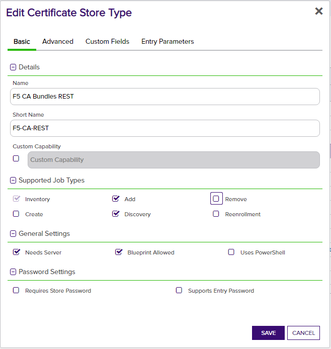
    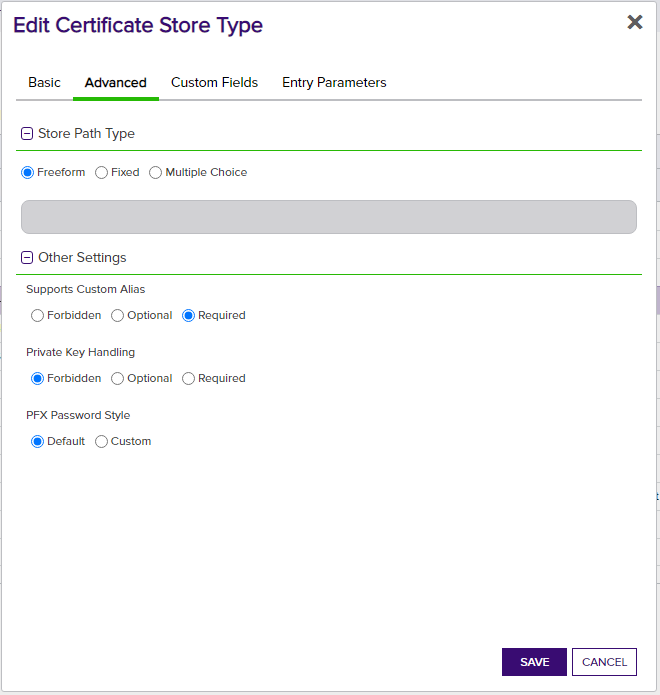


    **<u>Web Server Certificates</u>**

    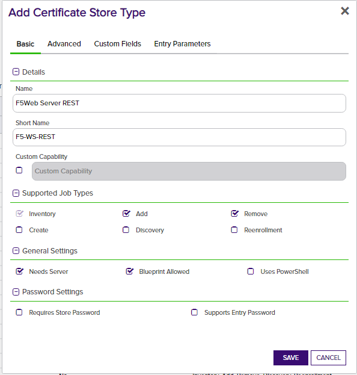
    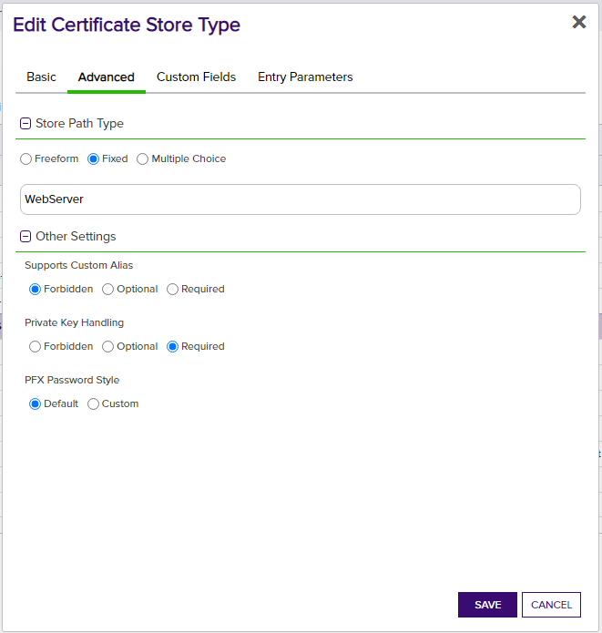


    **<u>SSL Certificates</u>**

    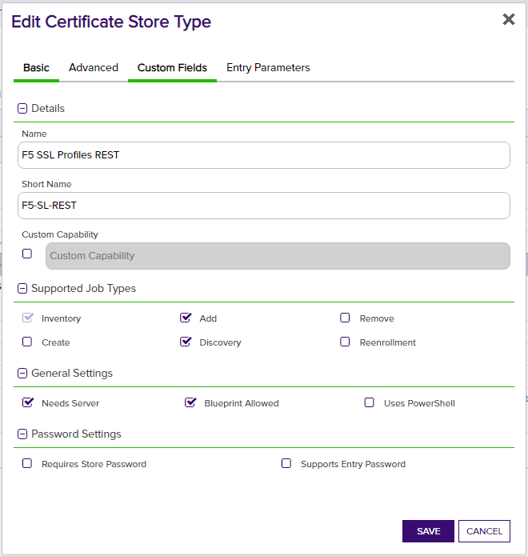
    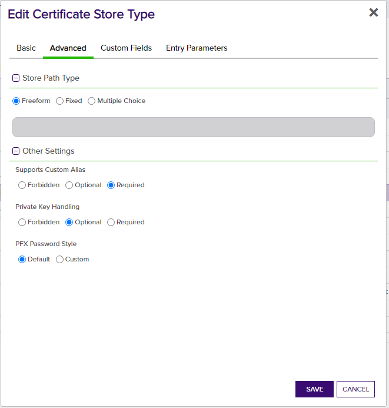

    - **Name** – Required. The display name of the new Certificate Store Type
    - **Short Name** – Required. This value ***must match*** the folder name for this store type under the "extensions" folder in the install path.
    - **Custom Capability** - Leave unchecked
    - **Supported Job Types** – Select Inventory and Add for all 3 types, and Discovery for CA Bundles and SSL Certificates.
    - **General Settings** - Select Needs Server.  Leave Uses PowerShell unchecked.  Select Blueprint Allowed if you plan to use blueprinting.
    - **Password Settings** - Leave both options unchecked
    - **All selections on Advanced tab** - Set the values on this tab ***exactly*** as they are shown in the above screen prints for each applicable store type.


    The Custom Fields tab contains 10 custom store parameters (3 of which, Server Username, Server Password, and Use SSL were set up on the Basic tab and are not actually custom parameters you need or want to modify on this tab).  The set up is consistent across store types, and should look as follows:

    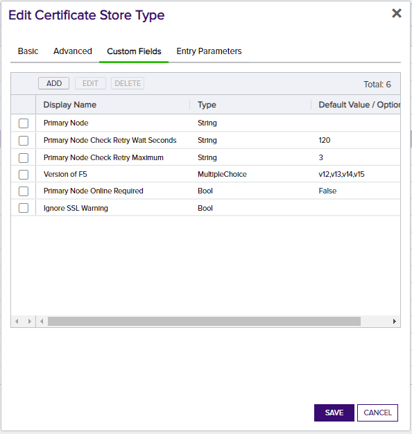<br>  
    <br>  
    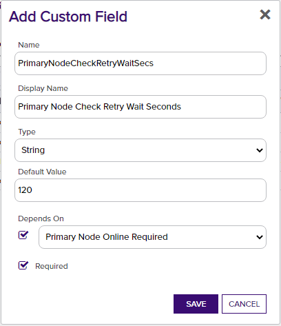<br>  
    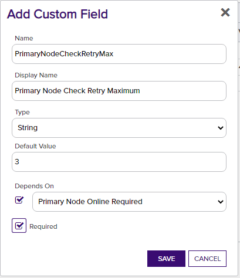<br>  
    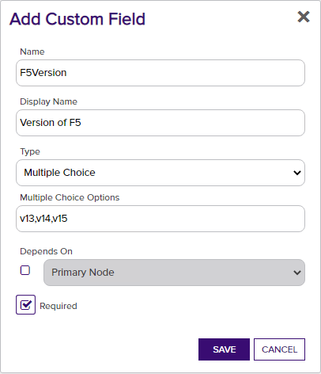<br>  
    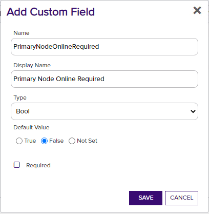<br>  
    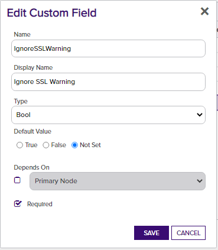<br>  
    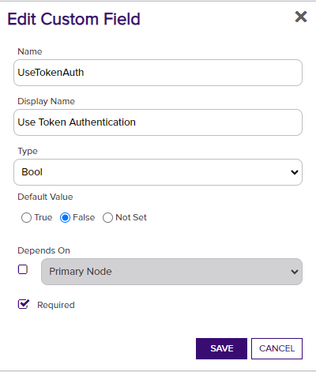<br>  

    If any or all of the 3 certificate store types were already set up on installation of Keyfactor, you may only need to add Primary Node Online Required and Ignore SSL Warning.  These parameters, however, are optional and only necessary if needed to be set to true.  Please see the descriptions below in "2a. Create a F5 Certificate Store wihin Keyfactor Command.


    **2a. Create a F5 Certificate Store within Keyfactor Command**  
    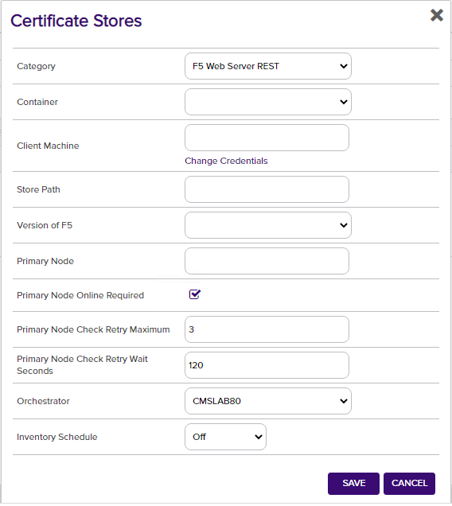  

    If you choose to manually create a F5 store In Keyfactor Command rather than running a Discovery job (Step 2b) to automatically find the store, you can navigate to Certificate Locations =\> Certificate Stores within Keyfactor Command to add the store. Below are the values that should be entered.

    - **Category** – Required.  One of the 3 F5 store types - F5 Web Server REST, F5 CA Bundles REST, or F5 SSL Profiles REST (your configured names may be different based on what you entered when creating the certificate store types in Step 1).

    - **Container** – Optional.  Select a container if utilized.

    - **Client Machine & Credentials** – Required.  The server name or IP Address and login credentials for the F5 device.  The credentials for server login can be any of:
      
      - UserId/Password
      
      - PAM provider information to pass the UserId/Password or UserId/SSH private key credentials
        
      When entering the credentials, UseSSL ***must*** be selected.
      
    - **Store Path** – Required.  Enter the name of the partition on the F5 device you wish to manage.  This value is case sensitive, so if the partition name is "Common", it must be entered as "Common" and not "common".

    - **Primary Node Online Required** – Optional.  Select this if you wish to stop the orchestrator from adding, replacing or renewing certificates on nodes that are inactive.  If this is not selected, adding, replacing and renewing certificates on inactive nodes will be allowed.  If you choose not to add this custom field, the default value of False will be assumed.

    - **Primary Node** - Only required (and shown) if Primary Node Online Required is added and selected.  Enter the fully qualified domain name of the F5 device that acts as the primary node in a highly available F5 implementation.  If you're using a single F5 device, this will typically be the same value you entered in the Client Machine field.

    - **Primary Node Check Retry Maximum** - Only required (and shown) if Primary Node Online Required is added and selected.  Enter the number of times a Management-Add job will attempt to add/replace/renew a certificate if the node is inactive before failing.

    - **Primary Node Check Retry Wait Seconds** - Only required (and shown) if Primary Node Online Required is added and selected.  Enter the number of seconds to wait between attempts to add/replace/renew a certificate if the node is inactive.

    - **Version of F5** - Required.  Select v13, v14, or v15 to match the version for the F5 device being managed

    - **Ignore SSL Warning** - Optional.  Select this if you wish to ignore SSL warnings from F5 that occur during API calls when the site does not have a trusted certificate with the proper SAN bound to it.  If you choose not to add this custom field, the default value of False will be assumed and SSL warnings will cause errors during orchestrator extension jobs.

    - **Use Token Authentication** - Optional.  Select this if you wish to use F5's token authentiation instead of basic authentication for all API requests.  If you choose not to add this custom field, the default value of False will be assumed and basic authentication will be used for all API requests for all jobs.  Setting this value to True will enable an initial basic authenticated request to acquire an authentication token, which will then be used for all subsequent API requests.

    - **Orchestrator** – Required.  Select the orchestrator you wish to use to manage this store

    - **Inventory Schedule** – Set a schedule for running Inventory jobs or none, if you choose not to schedule Inventory at this time.

    **2b. (Optional) Schedule a F5 Discovery Job**

    Rather than manually creating F5 certificate stores, you can schedule a Discovery job to search find them (CA Bundle and SSL Certificate store types only).

    First, in Keyfactor Command navigate to Certificate Locations =\> Certificate Stores. Select the Discover tab and then the Schedule button. Complete the dialog and click Done to schedule.
    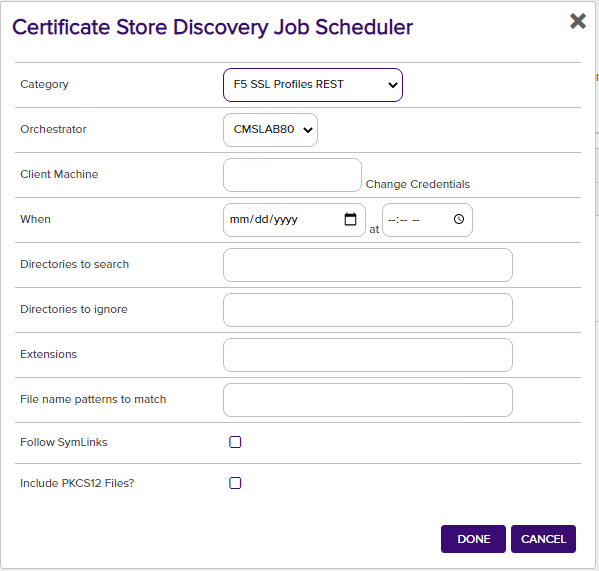

    - **Category** – Required. The F5 store type you wish to find stores for.

    - **Orchestrator** – Select the orchestrator you wish to use to manage this store

    - **Client Machine & Credentials** – Required.  The server name or IP Address and login credentials for the F5 device.  The credentials for server login can be any of:

      - UserId/Password
      - PAM provider information to pass the UserId/Password or UserId/SSH private key credentials
      
      When entering the credentials, UseSSL ***must*** be selected.
      
    - **When** – Required. The date and time when you would like this to execute.

    - **Directories to search** – Required but not used. This field is not used in the search to Discover certificate stores, but ***is*** a required field in this dialog, so just enter any value.  It will not be used.

    - **Directories to ignore/Extensions/File name patterns to match/Follow SymLinks/Include PKCS12 Files** – Not used.  Leave blank.

    Once the Discovery job has completed, a list of F5 certificate store locations should show in the Certificate Stores Discovery tab in Keyfactor Command. Right click on a store and select Approve to bring up a dialog that will ask for the remaining necessary certificate store parameters described in Step 2a.  Complete those and click Save, and the Certificate Store should now show up in the list of stores in the Certificate Stores tab.


    </details>

2. Create Certificate Store Types for the F5 Orchestrator extension. 

    * **Using kfutil**:

        ```shell
        # F5 SSL Profiles REST
        kfutil store-types create F5-SL-REST
        ```

    * **Manually**:
        * [F5 SSL Profiles REST](docs/f5-sl-rest.md#certificate-store-type-configuration)

3. Install the F5 Universal Orchestrator extension.
    
    * **Using kfutil**: On the server that that hosts the Universal Orchestrator, run the following command:

        ```shell
        # Windows Server
        kfutil orchestrator extension -e f5-rest-orchestrator@latest --out "C:\Program Files\Keyfactor\Keyfactor Orchestrator\extensions"

        # Linux
        kfutil orchestrator extension -e f5-rest-orchestrator@latest --out "/opt/keyfactor/orchestrator/extensions"
        ```

    * **Manually**: Follow the [official Command documentation](https://software.keyfactor.com/Core-OnPrem/Current/Content/InstallingAgents/NetCoreOrchestrator/CustomExtensions.htm?Highlight=extensions) to install the latest [F5 Universal Orchestrator extension](https://github.com/Keyfactor/f5-rest-orchestrator/releases/latest).

4. Create new certificate stores in Keyfactor Command for the Sample Universal Orchestrator extension.

    * [F5 SSL Profiles REST](docs/f5-sl-rest.md#certificate-store-configuration)


</details>

<details><summary>F5 WS Profiles REST</summary>


1. Follow the [requirements section](docs/f5-ws-rest.md#requirements) to configure a Service Account and grant necessary API permissions.

    <details><summary>Requirements</summary>

    ### F5 Orchestrator Installation

    1. Stop the Keyfactor Universal Orchestrator Service.
    2. In the Keyfactor Orchestrator installation folder (by convention usually C:\Program Files\Keyfactor\Keyfactor Orchestrator), find the "extensions" folder. Underneath that, create a new folder named F5 or another name of your choosing.
    3. Download the latest version of the F5 Orchestrator from [GitHub](https://github.com/Keyfactor/f5-rest-orchestrator).
    4. Copy the contents of the download installation zip file into the folder created in step 1.
    5. Start the Keyfactor Universal Orchestrator Service.

    ### F5 Orchestrator Configuration

    **1. In Keyfactor Command, if any of the aforementioned certificate store types do not already exist, create a new certificate store type for each of the 3 that you wish to manage by navigating to Settings (the "gear" icon in the top right) => Certificate Store Types.**

    **<u>CA Bundles:</u>**

    
    


    **<u>Web Server Certificates</u>**

    
    


    **<u>SSL Certificates</u>**

    
    

    - **Name** – Required. The display name of the new Certificate Store Type
    - **Short Name** – Required. This value ***must match*** the folder name for this store type under the "extensions" folder in the install path.
    - **Custom Capability** - Leave unchecked
    - **Supported Job Types** – Select Inventory and Add for all 3 types, and Discovery for CA Bundles and SSL Certificates.
    - **General Settings** - Select Needs Server.  Leave Uses PowerShell unchecked.  Select Blueprint Allowed if you plan to use blueprinting.
    - **Password Settings** - Leave both options unchecked
    - **All selections on Advanced tab** - Set the values on this tab ***exactly*** as they are shown in the above screen prints for each applicable store type.


    The Custom Fields tab contains 10 custom store parameters (3 of which, Server Username, Server Password, and Use SSL were set up on the Basic tab and are not actually custom parameters you need or want to modify on this tab).  The set up is consistent across store types, and should look as follows:

    <br>  
    <br>  
    <br>  
    <br>  
    <br>  
    <br>  
    <br>  
    <br>  

    If any or all of the 3 certificate store types were already set up on installation of Keyfactor, you may only need to add Primary Node Online Required and Ignore SSL Warning.  These parameters, however, are optional and only necessary if needed to be set to true.  Please see the descriptions below in "2a. Create a F5 Certificate Store wihin Keyfactor Command.


    **2a. Create a F5 Certificate Store within Keyfactor Command**  
      

    If you choose to manually create a F5 store In Keyfactor Command rather than running a Discovery job (Step 2b) to automatically find the store, you can navigate to Certificate Locations =\> Certificate Stores within Keyfactor Command to add the store. Below are the values that should be entered.

    - **Category** – Required.  One of the 3 F5 store types - F5 Web Server REST, F5 CA Bundles REST, or F5 SSL Profiles REST (your configured names may be different based on what you entered when creating the certificate store types in Step 1).

    - **Container** – Optional.  Select a container if utilized.

    - **Client Machine & Credentials** – Required.  The server name or IP Address and login credentials for the F5 device.  The credentials for server login can be any of:
      
      - UserId/Password
      
      - PAM provider information to pass the UserId/Password or UserId/SSH private key credentials
        
      When entering the credentials, UseSSL ***must*** be selected.
      
    - **Store Path** – Required.  Enter the name of the partition on the F5 device you wish to manage.  This value is case sensitive, so if the partition name is "Common", it must be entered as "Common" and not "common".

    - **Primary Node Online Required** – Optional.  Select this if you wish to stop the orchestrator from adding, replacing or renewing certificates on nodes that are inactive.  If this is not selected, adding, replacing and renewing certificates on inactive nodes will be allowed.  If you choose not to add this custom field, the default value of False will be assumed.

    - **Primary Node** - Only required (and shown) if Primary Node Online Required is added and selected.  Enter the fully qualified domain name of the F5 device that acts as the primary node in a highly available F5 implementation.  If you're using a single F5 device, this will typically be the same value you entered in the Client Machine field.

    - **Primary Node Check Retry Maximum** - Only required (and shown) if Primary Node Online Required is added and selected.  Enter the number of times a Management-Add job will attempt to add/replace/renew a certificate if the node is inactive before failing.

    - **Primary Node Check Retry Wait Seconds** - Only required (and shown) if Primary Node Online Required is added and selected.  Enter the number of seconds to wait between attempts to add/replace/renew a certificate if the node is inactive.

    - **Version of F5** - Required.  Select v13, v14, or v15 to match the version for the F5 device being managed

    - **Ignore SSL Warning** - Optional.  Select this if you wish to ignore SSL warnings from F5 that occur during API calls when the site does not have a trusted certificate with the proper SAN bound to it.  If you choose not to add this custom field, the default value of False will be assumed and SSL warnings will cause errors during orchestrator extension jobs.

    - **Use Token Authentication** - Optional.  Select this if you wish to use F5's token authentiation instead of basic authentication for all API requests.  If you choose not to add this custom field, the default value of False will be assumed and basic authentication will be used for all API requests for all jobs.  Setting this value to True will enable an initial basic authenticated request to acquire an authentication token, which will then be used for all subsequent API requests.

    - **Orchestrator** – Required.  Select the orchestrator you wish to use to manage this store

    - **Inventory Schedule** – Set a schedule for running Inventory jobs or none, if you choose not to schedule Inventory at this time.

    **2b. (Optional) Schedule a F5 Discovery Job**

    Rather than manually creating F5 certificate stores, you can schedule a Discovery job to search find them (CA Bundle and SSL Certificate store types only).

    First, in Keyfactor Command navigate to Certificate Locations =\> Certificate Stores. Select the Discover tab and then the Schedule button. Complete the dialog and click Done to schedule.
    

    - **Category** – Required. The F5 store type you wish to find stores for.

    - **Orchestrator** – Select the orchestrator you wish to use to manage this store

    - **Client Machine & Credentials** – Required.  The server name or IP Address and login credentials for the F5 device.  The credentials for server login can be any of:

      - UserId/Password
      - PAM provider information to pass the UserId/Password or UserId/SSH private key credentials
      
      When entering the credentials, UseSSL ***must*** be selected.
      
    - **When** – Required. The date and time when you would like this to execute.

    - **Directories to search** – Required but not used. This field is not used in the search to Discover certificate stores, but ***is*** a required field in this dialog, so just enter any value.  It will not be used.

    - **Directories to ignore/Extensions/File name patterns to match/Follow SymLinks/Include PKCS12 Files** – Not used.  Leave blank.

    Once the Discovery job has completed, a list of F5 certificate store locations should show in the Certificate Stores Discovery tab in Keyfactor Command. Right click on a store and select Approve to bring up a dialog that will ask for the remaining necessary certificate store parameters described in Step 2a.  Complete those and click Save, and the Certificate Store should now show up in the list of stores in the Certificate Stores tab.


    </details>

2. Create Certificate Store Types for the F5 Orchestrator extension. 

    * **Using kfutil**:

        ```shell
        # F5 WS Profiles REST
        kfutil store-types create F5-WS-REST
        ```

    * **Manually**:
        * [F5 WS Profiles REST](docs/f5-ws-rest.md#certificate-store-type-configuration)

3. Install the F5 Universal Orchestrator extension.
    
    * **Using kfutil**: On the server that that hosts the Universal Orchestrator, run the following command:

        ```shell
        # Windows Server
        kfutil orchestrator extension -e f5-rest-orchestrator@latest --out "C:\Program Files\Keyfactor\Keyfactor Orchestrator\extensions"

        # Linux
        kfutil orchestrator extension -e f5-rest-orchestrator@latest --out "/opt/keyfactor/orchestrator/extensions"
        ```

    * **Manually**: Follow the [official Command documentation](https://software.keyfactor.com/Core-OnPrem/Current/Content/InstallingAgents/NetCoreOrchestrator/CustomExtensions.htm?Highlight=extensions) to install the latest [F5 Universal Orchestrator extension](https://github.com/Keyfactor/f5-rest-orchestrator/releases/latest).

4. Create new certificate stores in Keyfactor Command for the Sample Universal Orchestrator extension.

    * [F5 WS Profiles REST](docs/f5-ws-rest.md#certificate-store-configuration)


</details>

<details><summary>F5 CA Profiles REST</summary>


1. Follow the [requirements section](docs/f5-ca-rest.md#requirements) to configure a Service Account and grant necessary API permissions.

    <details><summary>Requirements</summary>

    ### F5 Orchestrator Installation

    1. Stop the Keyfactor Universal Orchestrator Service.
    2. In the Keyfactor Orchestrator installation folder (by convention usually C:\Program Files\Keyfactor\Keyfactor Orchestrator), find the "extensions" folder. Underneath that, create a new folder named F5 or another name of your choosing.
    3. Download the latest version of the F5 Orchestrator from [GitHub](https://github.com/Keyfactor/f5-rest-orchestrator).
    4. Copy the contents of the download installation zip file into the folder created in step 1.
    5. Start the Keyfactor Universal Orchestrator Service.

    ### F5 Orchestrator Configuration

    **1. In Keyfactor Command, if any of the aforementioned certificate store types do not already exist, create a new certificate store type for each of the 3 that you wish to manage by navigating to Settings (the "gear" icon in the top right) => Certificate Store Types.**

    **<u>CA Bundles:</u>**

    
    


    **<u>Web Server Certificates</u>**

    
    


    **<u>SSL Certificates</u>**

    
    

    - **Name** – Required. The display name of the new Certificate Store Type
    - **Short Name** – Required. This value ***must match*** the folder name for this store type under the "extensions" folder in the install path.
    - **Custom Capability** - Leave unchecked
    - **Supported Job Types** – Select Inventory and Add for all 3 types, and Discovery for CA Bundles and SSL Certificates.
    - **General Settings** - Select Needs Server.  Leave Uses PowerShell unchecked.  Select Blueprint Allowed if you plan to use blueprinting.
    - **Password Settings** - Leave both options unchecked
    - **All selections on Advanced tab** - Set the values on this tab ***exactly*** as they are shown in the above screen prints for each applicable store type.


    The Custom Fields tab contains 10 custom store parameters (3 of which, Server Username, Server Password, and Use SSL were set up on the Basic tab and are not actually custom parameters you need or want to modify on this tab).  The set up is consistent across store types, and should look as follows:

    <br>  
    <br>  
    <br>  
    <br>  
    <br>  
    <br>  
    <br>  
    <br>  

    If any or all of the 3 certificate store types were already set up on installation of Keyfactor, you may only need to add Primary Node Online Required and Ignore SSL Warning.  These parameters, however, are optional and only necessary if needed to be set to true.  Please see the descriptions below in "2a. Create a F5 Certificate Store wihin Keyfactor Command.


    **2a. Create a F5 Certificate Store within Keyfactor Command**  
      

    If you choose to manually create a F5 store In Keyfactor Command rather than running a Discovery job (Step 2b) to automatically find the store, you can navigate to Certificate Locations =\> Certificate Stores within Keyfactor Command to add the store. Below are the values that should be entered.

    - **Category** – Required.  One of the 3 F5 store types - F5 Web Server REST, F5 CA Bundles REST, or F5 SSL Profiles REST (your configured names may be different based on what you entered when creating the certificate store types in Step 1).

    - **Container** – Optional.  Select a container if utilized.

    - **Client Machine & Credentials** – Required.  The server name or IP Address and login credentials for the F5 device.  The credentials for server login can be any of:
      
      - UserId/Password
      
      - PAM provider information to pass the UserId/Password or UserId/SSH private key credentials
        
      When entering the credentials, UseSSL ***must*** be selected.
      
    - **Store Path** – Required.  Enter the name of the partition on the F5 device you wish to manage.  This value is case sensitive, so if the partition name is "Common", it must be entered as "Common" and not "common".

    - **Primary Node Online Required** – Optional.  Select this if you wish to stop the orchestrator from adding, replacing or renewing certificates on nodes that are inactive.  If this is not selected, adding, replacing and renewing certificates on inactive nodes will be allowed.  If you choose not to add this custom field, the default value of False will be assumed.

    - **Primary Node** - Only required (and shown) if Primary Node Online Required is added and selected.  Enter the fully qualified domain name of the F5 device that acts as the primary node in a highly available F5 implementation.  If you're using a single F5 device, this will typically be the same value you entered in the Client Machine field.

    - **Primary Node Check Retry Maximum** - Only required (and shown) if Primary Node Online Required is added and selected.  Enter the number of times a Management-Add job will attempt to add/replace/renew a certificate if the node is inactive before failing.

    - **Primary Node Check Retry Wait Seconds** - Only required (and shown) if Primary Node Online Required is added and selected.  Enter the number of seconds to wait between attempts to add/replace/renew a certificate if the node is inactive.

    - **Version of F5** - Required.  Select v13, v14, or v15 to match the version for the F5 device being managed

    - **Ignore SSL Warning** - Optional.  Select this if you wish to ignore SSL warnings from F5 that occur during API calls when the site does not have a trusted certificate with the proper SAN bound to it.  If you choose not to add this custom field, the default value of False will be assumed and SSL warnings will cause errors during orchestrator extension jobs.

    - **Use Token Authentication** - Optional.  Select this if you wish to use F5's token authentiation instead of basic authentication for all API requests.  If you choose not to add this custom field, the default value of False will be assumed and basic authentication will be used for all API requests for all jobs.  Setting this value to True will enable an initial basic authenticated request to acquire an authentication token, which will then be used for all subsequent API requests.

    - **Orchestrator** – Required.  Select the orchestrator you wish to use to manage this store

    - **Inventory Schedule** – Set a schedule for running Inventory jobs or none, if you choose not to schedule Inventory at this time.

    **2b. (Optional) Schedule a F5 Discovery Job**

    Rather than manually creating F5 certificate stores, you can schedule a Discovery job to search find them (CA Bundle and SSL Certificate store types only).

    First, in Keyfactor Command navigate to Certificate Locations =\> Certificate Stores. Select the Discover tab and then the Schedule button. Complete the dialog and click Done to schedule.
    

    - **Category** – Required. The F5 store type you wish to find stores for.

    - **Orchestrator** – Select the orchestrator you wish to use to manage this store

    - **Client Machine & Credentials** – Required.  The server name or IP Address and login credentials for the F5 device.  The credentials for server login can be any of:

      - UserId/Password
      - PAM provider information to pass the UserId/Password or UserId/SSH private key credentials
      
      When entering the credentials, UseSSL ***must*** be selected.
      
    - **When** – Required. The date and time when you would like this to execute.

    - **Directories to search** – Required but not used. This field is not used in the search to Discover certificate stores, but ***is*** a required field in this dialog, so just enter any value.  It will not be used.

    - **Directories to ignore/Extensions/File name patterns to match/Follow SymLinks/Include PKCS12 Files** – Not used.  Leave blank.

    Once the Discovery job has completed, a list of F5 certificate store locations should show in the Certificate Stores Discovery tab in Keyfactor Command. Right click on a store and select Approve to bring up a dialog that will ask for the remaining necessary certificate store parameters described in Step 2a.  Complete those and click Save, and the Certificate Store should now show up in the list of stores in the Certificate Stores tab.


    </details>

2. Create Certificate Store Types for the F5 Orchestrator extension. 

    * **Using kfutil**:

        ```shell
        # F5 CA Profiles REST
        kfutil store-types create F5-CA-REST
        ```

    * **Manually**:
        * [F5 CA Profiles REST](docs/f5-ca-rest.md#certificate-store-type-configuration)

3. Install the F5 Universal Orchestrator extension.
    
    * **Using kfutil**: On the server that that hosts the Universal Orchestrator, run the following command:

        ```shell
        # Windows Server
        kfutil orchestrator extension -e f5-rest-orchestrator@latest --out "C:\Program Files\Keyfactor\Keyfactor Orchestrator\extensions"

        # Linux
        kfutil orchestrator extension -e f5-rest-orchestrator@latest --out "/opt/keyfactor/orchestrator/extensions"
        ```

    * **Manually**: Follow the [official Command documentation](https://software.keyfactor.com/Core-OnPrem/Current/Content/InstallingAgents/NetCoreOrchestrator/CustomExtensions.htm?Highlight=extensions) to install the latest [F5 Universal Orchestrator extension](https://github.com/Keyfactor/f5-rest-orchestrator/releases/latest).

4. Create new certificate stores in Keyfactor Command for the Sample Universal Orchestrator extension.

    * [F5 CA Profiles REST](docs/f5-ca-rest.md#certificate-store-configuration)


</details>


## License

Apache License 2.0, see [LICENSE](LICENSE).

## Related Integrations

See all [Keyfactor Universal Orchestrator extensions](https://github.com/orgs/Keyfactor/repositories?q=orchestrator).