<h1 align="center" style="border-bottom: none">
    F5 Universal Orchestrator Extension
</h1>

<p align="center">
  <!-- Badges -->

<a href="https://github.com/Keyfactor/f5-rest-orchestrator/releases"></a>


</p>

<p align="center">
  <!-- TOC -->
  <a href="#support">
    <b>Support</b>
  </a>
  ·
  <a href="#installation">
    <b>Installation</b>
  </a>
  ·
  <a href="#license">
    <b>License</b>
  </a>
  ·
  <a href="https://github.com/orgs/Keyfactor/repositories?q=orchestrator">
    <b>Related Integrations</b>
  </a>
</p>

## Overview

The f5-rest-orchestrator orchestrator extension manages various types of certificates on a F5 Big IP device (version 14 or later).  TLS certificates, CA bundles, and the TLS certificate bound to the administrative website can all be managed with this integration within the scope described in the sections below.  One important note, this integration DOES NOT manage high availability (HA) failover between primary and secondary nodes.  If syncing between primary and secondary nodes is desired, this must either be handled within your F5 Big IP instance itself, or you can set up a Keyfactor Command certificate store for each node (primary and secondary) and manage each separately.

The F5 Universal Orchestrator extension implements 3 Certificate Store Types. Depending on your use case, you may elect to use one, or all of these Certificate Store Types. Descriptions of each are provided below.
- [F5 SSL Profiles REST](#F5-SL-REST)
- [F5 WS Profiles REST](#F5-WS-REST)
- [F5 CA Profiles REST](#F5-CA-REST)

## Compatibility

This integration is compatible with Keyfactor Universal Orchestrator version 10.1 and later.

## Support

The F5 Universal Orchestrator extension is supported by Keyfactor. If you require support for any issues or have feature request, please open a support ticket by either contacting your Keyfactor representative or via the Keyfactor Support Portal at https://support.keyfactor.com.

> If you want to contribute bug fixes or additional enhancements, use the **[Pull requests](../../pulls)** tab.

## Requirements & Prerequisites

Before installing the F5 Universal Orchestrator extension, we recommend that you install [kfutil](https://github.com/Keyfactor/kfutil). Kfutil is a command-line tool that simplifies the process of creating store types, installing extensions, and instantiating certificate stores in Keyfactor Command.

An administrator account must be set up in F5 to be used with this orchestrator extension.  This F5 user id is what must be used as credentials when setting up a Keyfactor Command certificate store pointing to the F5 device intending to be managed.

## Certificate Store Types

To use the F5 Universal Orchestrator extension, you **must** create the Certificate Store Types required for your use-case. This only needs to happen _once_ per Keyfactor Command instance.

The F5 Universal Orchestrator extension implements 3 Certificate Store Types. Depending on your use case, you may elect to use one, or all of these Certificate Store Types.

### F5-SL-REST

<details><summary>Click to expand details</summary>

The F5-SL-REST certificate store type manages F5 Big IP TLS certificates.  Renewal of bound certificates is supported, but adding new bindings for new or replacement certificates is not. This store type **does** track the SSL Profiles a certificate is bound to by way of the SSL Profiles entry parameter.  Inventory jobs will return a comma delimited list of SSL Profile names that each certificate is bound to and return this in the SSLProfiles entry parameter.

#### Supported Operations

| Operation    | Is Supported |
|--------------|--------------|
| Add          | ✅ Checked |
| Remove       | ✅ Checked |
| Discovery    | ✅ Checked |
| Reenrollment | 🔲 Unchecked |
| Create       | 🔲 Unchecked |

#### Store Type Creation

##### Using kfutil:
`kfutil` is a custom CLI for the Keyfactor Command API and can be used to create certificate store types.
For more information on [kfutil](https://github.com/Keyfactor/kfutil) check out the [docs](https://github.com/Keyfactor/kfutil?tab=readme-ov-file#quickstart)

   <details><summary>Click to expand F5-SL-REST kfutil details</summary>

   ##### Using online definition from GitHub:
   This will reach out to GitHub and pull the latest store-type definition
   ```shell
   # F5 SSL Profiles REST
   kfutil store-types create F5-SL-REST
   ```

   ##### Offline creation using integration-manifest file:
   If required, it is possible to create store types from the [integration-manifest.json](./integration-manifest.json) included in this repo.
   You would first download the [integration-manifest.json](./integration-manifest.json) and then run the following command
   in your offline environment.
   ```shell
   kfutil store-types create --from-file integration-manifest.json
   ```
   </details>

#### Manual Creation
Below are instructions on how to create the F5-SL-REST store type manually in
the Keyfactor Command Portal

   <details><summary>Click to expand manual F5-SL-REST details</summary>

   Create a store type called `F5-SL-REST` with the attributes in the tables below:

   ##### Basic Tab
   | Attribute | Value | Description |
   | --------- | ----- | ----- |
   | Name | F5 SSL Profiles REST | Display name for the store type (may be customized) |
   | Short Name | F5-SL-REST | Short display name for the store type |
   | Capability | F5-SL-REST | Store type name orchestrator will register with. Check the box to allow entry of value |
   | Supports Add | ✅ Checked | Indicates that the Store Type supports Management Add |
   | Supports Remove | ✅ Checked | Indicates that the Store Type supports Management Remove |
   | Supports Discovery | ✅ Checked | Indicates that the Store Type supports Discovery |
   | Supports Reenrollment | 🔲 Unchecked | Indicates that the Store Type supports Reenrollment |
   | Supports Create | 🔲 Unchecked | Indicates that the Store Type supports store creation |
   | Needs Server | ✅ Checked | Determines if a target server name is required when creating store |
   | Blueprint Allowed | ✅ Checked | Determines if store type may be included in an Orchestrator blueprint |
   | Uses PowerShell | 🔲 Unchecked | Determines if underlying implementation is PowerShell |
   | Requires Store Password | ✅ Checked | Enables users to optionally specify a store password when defining a Certificate Store. |
   | Supports Entry Password | 🔲 Unchecked | Determines if an individual entry within a store can have a password. |

   The Basic tab should look like this:

   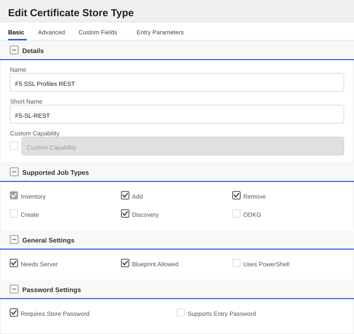

   ##### Advanced Tab
   | Attribute | Value | Description |
   | --------- | ----- | ----- |
   | Supports Custom Alias | Required | Determines if an individual entry within a store can have a custom Alias. |
   | Private Key Handling | Optional | This determines if Keyfactor can send the private key associated with a certificate to the store. |
   | PFX Password Style | Default | 'Default' - PFX password is randomly generated, 'Custom' - PFX password may be specified when the enrollment job is created (Requires the Allow Custom Password application setting to be enabled.) |

   The Advanced tab should look like this:

   

   > For Keyfactor **Command versions 24.4 and later**, a Certificate Format dropdown is available with PFX and PEM options. Ensure that **PFX** is selected, as this determines the format of new and renewed certificates sent to the Orchestrator during a Management job. Currently, all Keyfactor-supported Orchestrator extensions support only PFX.

   ##### Custom Fields Tab
   Custom fields operate at the certificate store level and are used to control how the orchestrator connects to the remote target server containing the certificate store to be managed. The following custom fields should be added to the store type:

   | Name | Display Name | Description | Type | Default Value/Options | Required |
   | ---- | ------------ | ---- | --------------------- | -------- | ----------- |
   | PrimaryNode | Primary Node | Only required (and shown) if Primary Node Online Required is added and selected.  Enter the Host Name of the F5 device that acts as the primary node in a highly available F5 implementation. Please note that this value IS case sensitive. | String |  | ✅ Checked |
   | PrimaryNodeCheckRetryWaitSecs | Primary Node Check Retry Wait Seconds | Enter the number of seconds to wait between attempts to add/replace/renew a certificate if the node is inactive. | String | 120 | ✅ Checked |
   | PrimaryNodeCheckRetryMax | Primary Node Check Retry Maximum | Enter the number of times a Management-Add job will attempt to add/replace/renew a certificate if the node is inactive before failing. | String | 3 | ✅ Checked |
   | PrimaryNodeOnlineRequired | Primary Node Online Required | Select this if you wish to stop the orchestrator from adding, replacing or renewing certificates on nodes that are inactive. If this is not selected, adding, replacing and renewing certificates on inactive nodes will be allowed. If you choose not to add this custom field, the default value of False will be assumed. | Bool |  | ✅ Checked |
   | RemoveChain | Remove Chain on Add | Optional setting.  Set this to true if you would like to remove the certificate chain before adding or replacing a certificate on your F5 device. | Bool | False | 🔲 Unchecked |
   | IgnoreSSLWarning | Ignore SSL Warning | Select this if you wish to ignore SSL warnings from F5 that occur during API calls when the site does not have a trusted certificate with the proper SAN bound to it. If you choose not to add this custom field, the default value of False will be assumed and SSL warnings will cause errors during orchestrator extension jobs. | Bool | False | ✅ Checked |
   | UseTokenAuth | Use Token Authentication | Select this if you wish to use F5's token authentication instead of basic authentication for all API requests. If you choose not to add this custom field, the default value of False will be assumed and basic authentication will be used for all API requests for all jobs. Setting this value to True will enable an initial basic authenticated request to acquire an authentication token, which will then be used for all subsequent API requests. | Bool | false | ✅ Checked |
   | SyncDevice | Sync To Device Group | Set this to True if you wish to sync this node to a pre-configured F5 device group.  See [Syncing to Device Group](syncing-to-device-group) for more information on this feature. | Bool | false | ✅ Checked |
   | SyncDeviceGroup | Device Group | Enter the name of the pre-configured F5 device group you wish to sync to (valid if SyncDevice = True).  See [Syncing to Device Group](syncing-to-device-group) for more information on this feature. | String | DeviceGroup | ✅ Checked |
   | ServerUsername | Server Username | Login credential for the F5 device.  MUST be an Admin account. | Secret |  | 🔲 Unchecked |
   | ServerPassword | Server Password | Login password for the F5 device. | Secret |  | 🔲 Unchecked |
   | ServerUseSsl | Use SSL | True if using https to access the F5 device. False if using http. | Bool | true | ✅ Checked |

   The Custom Fields tab should look like this:

   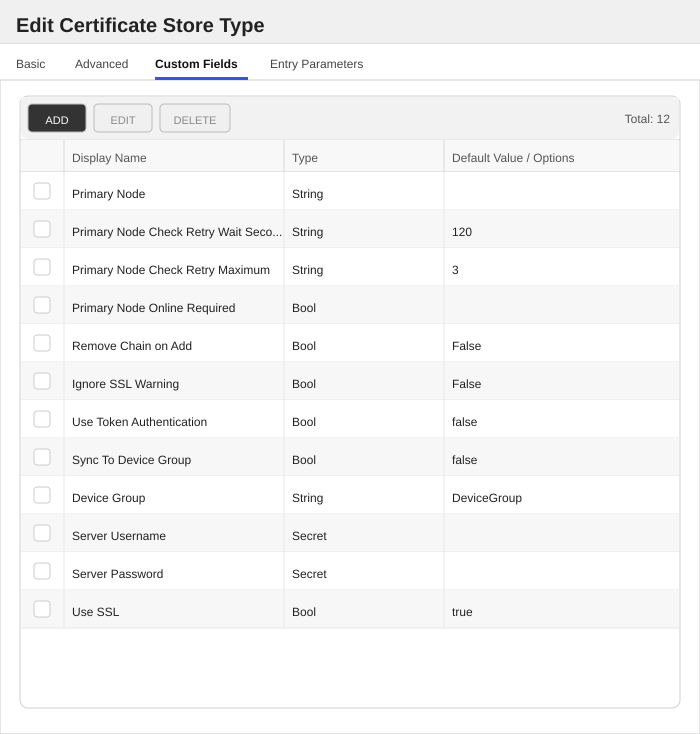

   ###### Primary Node
   Only required (and shown) if Primary Node Online Required is added and selected.  Enter the Host Name of the F5 device that acts as the primary node in a highly available F5 implementation. Please note that this value IS case sensitive.

   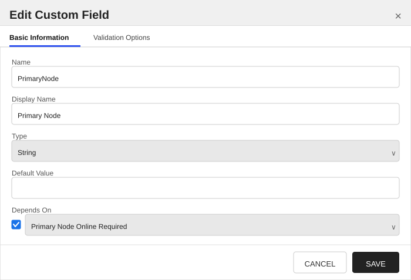
   


   ###### Primary Node Check Retry Wait Seconds
   Enter the number of seconds to wait between attempts to add/replace/renew a certificate if the node is inactive.

   
   


   ###### Primary Node Check Retry Maximum
   Enter the number of times a Management-Add job will attempt to add/replace/renew a certificate if the node is inactive before failing.

   
   


   ###### Primary Node Online Required
   Select this if you wish to stop the orchestrator from adding, replacing or renewing certificates on nodes that are inactive. If this is not selected, adding, replacing and renewing certificates on inactive nodes will be allowed. If you choose not to add this custom field, the default value of False will be assumed.

   
   


   ###### Remove Chain on Add
   Optional setting.  Set this to true if you would like to remove the certificate chain before adding or replacing a certificate on your F5 device.

   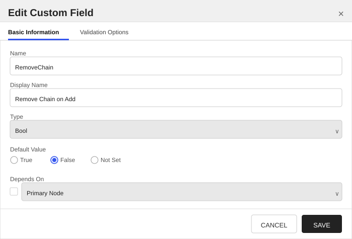
   


   ###### Ignore SSL Warning
   Select this if you wish to ignore SSL warnings from F5 that occur during API calls when the site does not have a trusted certificate with the proper SAN bound to it. If you choose not to add this custom field, the default value of False will be assumed and SSL warnings will cause errors during orchestrator extension jobs.

   
   


   ###### Use Token Authentication
   Select this if you wish to use F5's token authentication instead of basic authentication for all API requests. If you choose not to add this custom field, the default value of False will be assumed and basic authentication will be used for all API requests for all jobs. Setting this value to True will enable an initial basic authenticated request to acquire an authentication token, which will then be used for all subsequent API requests.

   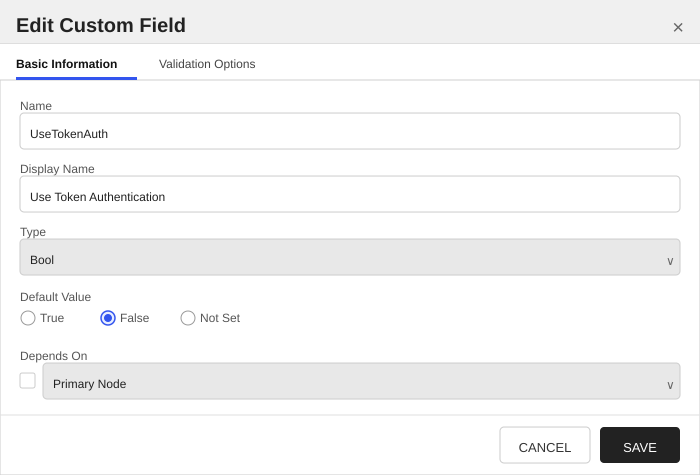
   


   ###### Sync To Device Group
   Set this to True if you wish to sync this node to a pre-configured F5 device group.  See [Syncing to Device Group](syncing-to-device-group) for more information on this feature.

   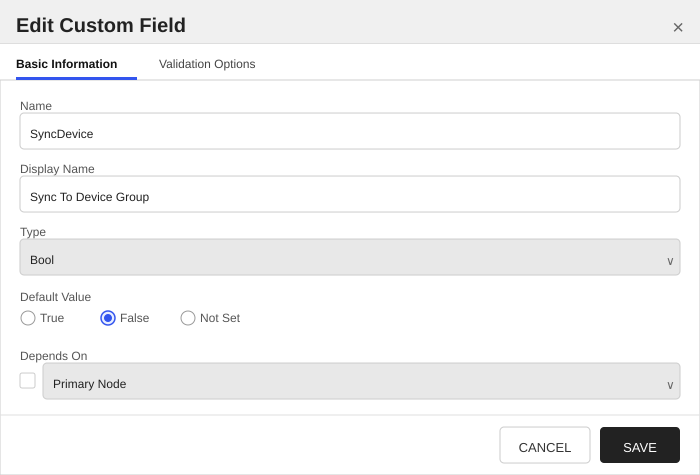
   


   ###### Device Group
   Enter the name of the pre-configured F5 device group you wish to sync to (valid if SyncDevice = True).  See [Syncing to Device Group](syncing-to-device-group) for more information on this feature.

   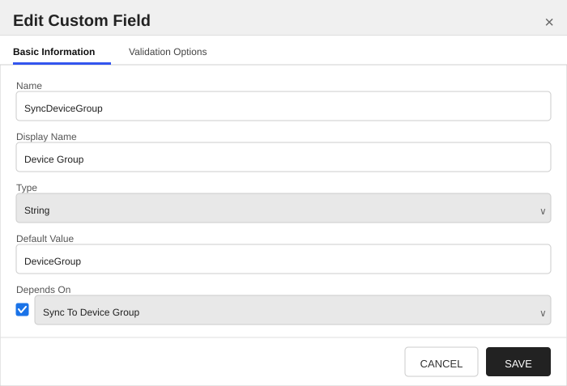
   


   ###### Server Username
   Login credential for the F5 device.  MUST be an Admin account.


   > [!IMPORTANT]
   > This field is created by the `Needs Server` on the Basic tab, do not create this field manually.


   ###### Server Password
   Login password for the F5 device.


   > [!IMPORTANT]
   > This field is created by the `Needs Server` on the Basic tab, do not create this field manually.


   ###### Use SSL
   True if using https to access the F5 device. False if using http.

   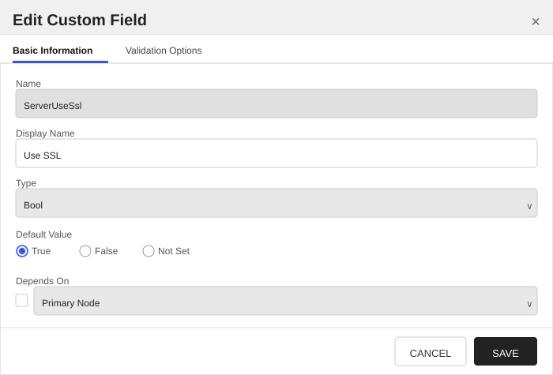
   


   ##### Entry Parameters Tab

   | Name | Display Name | Description | Type | Default Value | Entry has a private key | Adding an entry | Removing an entry | Reenrolling an entry |
   | ---- | ------------ | ---- | ------------- | ----------------------- | ---------------- | ----------------- | ------------------- | ----------- |
   | SSLProfiles | SSL Profiles | One to many comma delimited F5 SSL Profiles to bind the certificate to (new certificates ONLY) | String |  | 🔲 Unchecked | 🔲 Unchecked | 🔲 Unchecked | 🔲 Unchecked |

   The Entry Parameters tab should look like this:

   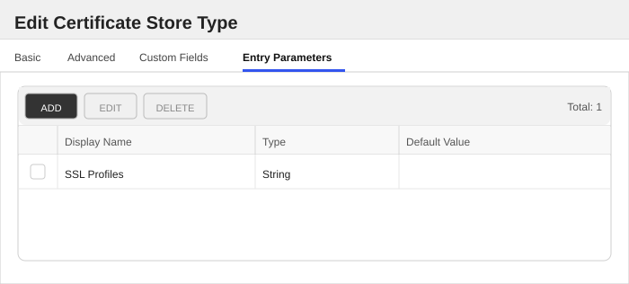
   ##### SSL Profiles
   One to many comma delimited F5 SSL Profiles to bind the certificate to (new certificates ONLY)

   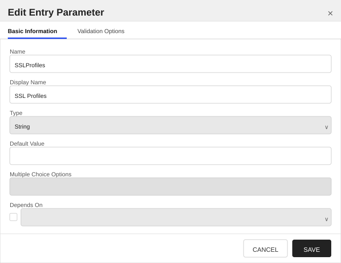
   


   </details>
</details>

### F5-WS-REST

<details><summary>Click to expand details</summary>

The F5-WS-REST certificate store type manages the TLS certificate bound to the F5 administration website.  While replacing the existing website certificate is supported, adding a new certificate if one is not already present is not due to F5 limitations.

#### Supported Operations

| Operation    | Is Supported |
|--------------|--------------|
| Add          | ✅ Checked |
| Remove       | 🔲 Unchecked |
| Discovery    | 🔲 Unchecked |
| Reenrollment | 🔲 Unchecked |
| Create       | 🔲 Unchecked |

#### Store Type Creation

##### Using kfutil:
`kfutil` is a custom CLI for the Keyfactor Command API and can be used to create certificate store types.
For more information on [kfutil](https://github.com/Keyfactor/kfutil) check out the [docs](https://github.com/Keyfactor/kfutil?tab=readme-ov-file#quickstart)

   <details><summary>Click to expand F5-WS-REST kfutil details</summary>

   ##### Using online definition from GitHub:
   This will reach out to GitHub and pull the latest store-type definition
   ```shell
   # F5 WS Profiles REST
   kfutil store-types create F5-WS-REST
   ```

   ##### Offline creation using integration-manifest file:
   If required, it is possible to create store types from the [integration-manifest.json](./integration-manifest.json) included in this repo.
   You would first download the [integration-manifest.json](./integration-manifest.json) and then run the following command
   in your offline environment.
   ```shell
   kfutil store-types create --from-file integration-manifest.json
   ```
   </details>

#### Manual Creation
Below are instructions on how to create the F5-WS-REST store type manually in
the Keyfactor Command Portal

   <details><summary>Click to expand manual F5-WS-REST details</summary>

   Create a store type called `F5-WS-REST` with the attributes in the tables below:

   ##### Basic Tab
   | Attribute | Value | Description |
   | --------- | ----- | ----- |
   | Name | F5 WS Profiles REST | Display name for the store type (may be customized) |
   | Short Name | F5-WS-REST | Short display name for the store type |
   | Capability | F5-WS-REST | Store type name orchestrator will register with. Check the box to allow entry of value |
   | Supports Add | ✅ Checked | Indicates that the Store Type supports Management Add |
   | Supports Remove | 🔲 Unchecked | Indicates that the Store Type supports Management Remove |
   | Supports Discovery | 🔲 Unchecked | Indicates that the Store Type supports Discovery |
   | Supports Reenrollment | 🔲 Unchecked | Indicates that the Store Type supports Reenrollment |
   | Supports Create | 🔲 Unchecked | Indicates that the Store Type supports store creation |
   | Needs Server | ✅ Checked | Determines if a target server name is required when creating store |
   | Blueprint Allowed | ✅ Checked | Determines if store type may be included in an Orchestrator blueprint |
   | Uses PowerShell | 🔲 Unchecked | Determines if underlying implementation is PowerShell |
   | Requires Store Password | 🔲 Unchecked | Enables users to optionally specify a store password when defining a Certificate Store. |
   | Supports Entry Password | 🔲 Unchecked | Determines if an individual entry within a store can have a password. |

   The Basic tab should look like this:

   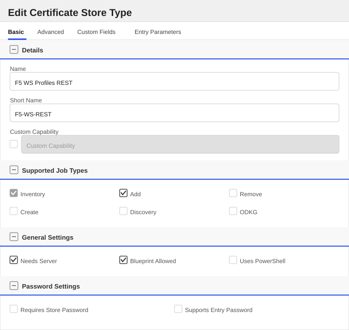

   ##### Advanced Tab
   | Attribute | Value | Description |
   | --------- | ----- | ----- |
   | Supports Custom Alias | Forbidden | Determines if an individual entry within a store can have a custom Alias. |
   | Private Key Handling | Required | This determines if Keyfactor can send the private key associated with a certificate to the store. |
   | PFX Password Style | Default | 'Default' - PFX password is randomly generated, 'Custom' - PFX password may be specified when the enrollment job is created (Requires the Allow Custom Password application setting to be enabled.) |

   The Advanced tab should look like this:

   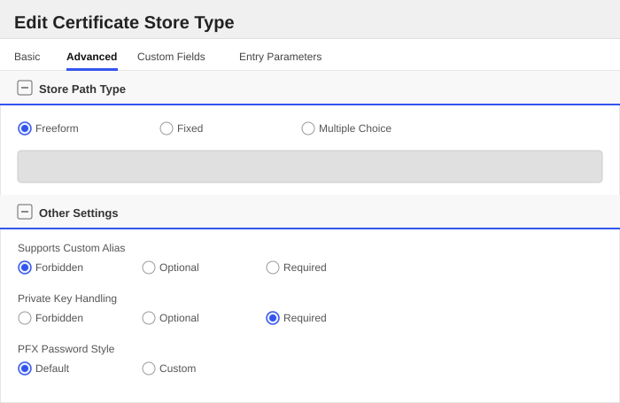

   > For Keyfactor **Command versions 24.4 and later**, a Certificate Format dropdown is available with PFX and PEM options. Ensure that **PFX** is selected, as this determines the format of new and renewed certificates sent to the Orchestrator during a Management job. Currently, all Keyfactor-supported Orchestrator extensions support only PFX.

   ##### Custom Fields Tab
   Custom fields operate at the certificate store level and are used to control how the orchestrator connects to the remote target server containing the certificate store to be managed. The following custom fields should be added to the store type:

   | Name | Display Name | Description | Type | Default Value/Options | Required |
   | ---- | ------------ | ---- | --------------------- | -------- | ----------- |
   | PrimaryNode | Primary Node | Only required (and shown) if Primary Node Online Required is added and selected.  Enter the Host Name of the F5 device that acts as the primary node in a highly available F5 implementation. Please note that this value IS case sensitive. | String |  | ✅ Checked |
   | PrimaryNodeCheckRetryWaitSecs | Primary Node Check Retry Wait Seconds | Enter the number of seconds to wait between attempts to add/replace/renew a certificate if the node is inactive. | String | 120 | ✅ Checked |
   | PrimaryNodeCheckRetryMax | Primary Node Check Retry Maximum | Enter the number of times a Management-Add job will attempt to add/replace/renew a certificate if the node is inactive before failing. | String | 3 | ✅ Checked |
   | PrimaryNodeOnlineRequired | Primary Node Online Required | Select this if you wish to stop the orchestrator from adding, replacing or renewing certificates on nodes that are inactive. If this is not selected, adding, replacing and renewing certificates on inactive nodes will be allowed. If you choose not to add this custom field, the default value of False will be assumed. | Bool |  | ✅ Checked |
   | IgnoreSSLWarning | Ignore SSL Warning | Select this if you wish to ignore SSL warnings from F5 that occur during API calls when the site does not have a trusted certificate with the proper SAN bound to it. If you choose not to add this custom field, the default value of False will be assumed and SSL warnings will cause errors during orchestrator extension jobs. | Bool | False | ✅ Checked |
   | UseTokenAuth | Use Token Authentication | Select this if you wish to use F5's token authentiation instead of basic authentication for all API requests. If you choose not to add this custom field, the default value of False will be assumed and basic authentication will be used for all API requests for all jobs. Setting this value to True will enable an initial basic authenticated request to acquire an authentication token, which will then be used for all subsequent API requests. | Bool | false | ✅ Checked |
   | ServerUsername | Server Username | Login credential for the F5 device.  MUST be an Admin account. | Secret |  | 🔲 Unchecked |
   | ServerPassword | Server Password | Login password for the F5 device. | Secret |  | 🔲 Unchecked |
   | ServerUseSsl | Use SSL | True if using https to access the F5 device. False if using http. | Bool | true | ✅ Checked |

   The Custom Fields tab should look like this:

   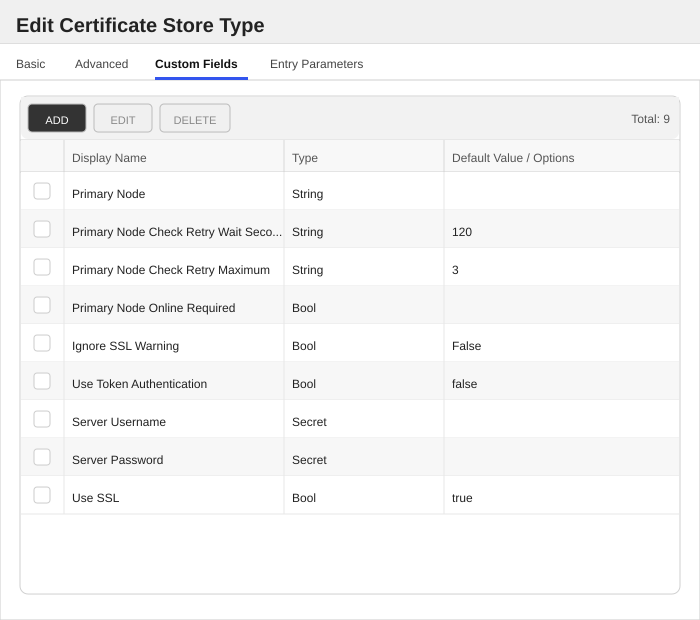

   ###### Primary Node
   Only required (and shown) if Primary Node Online Required is added and selected.  Enter the Host Name of the F5 device that acts as the primary node in a highly available F5 implementation. Please note that this value IS case sensitive.

   
   


   ###### Primary Node Check Retry Wait Seconds
   Enter the number of seconds to wait between attempts to add/replace/renew a certificate if the node is inactive.

   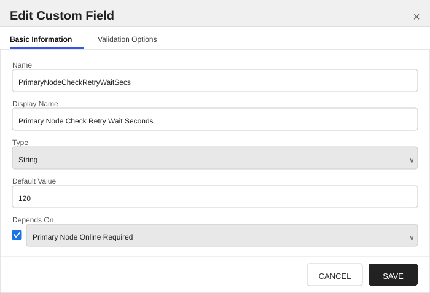
   


   ###### Primary Node Check Retry Maximum
   Enter the number of times a Management-Add job will attempt to add/replace/renew a certificate if the node is inactive before failing.

   
   


   ###### Primary Node Online Required
   Select this if you wish to stop the orchestrator from adding, replacing or renewing certificates on nodes that are inactive. If this is not selected, adding, replacing and renewing certificates on inactive nodes will be allowed. If you choose not to add this custom field, the default value of False will be assumed.

   
   


   ###### Ignore SSL Warning
   Select this if you wish to ignore SSL warnings from F5 that occur during API calls when the site does not have a trusted certificate with the proper SAN bound to it. If you choose not to add this custom field, the default value of False will be assumed and SSL warnings will cause errors during orchestrator extension jobs.

   
   


   ###### Use Token Authentication
   Select this if you wish to use F5's token authentiation instead of basic authentication for all API requests. If you choose not to add this custom field, the default value of False will be assumed and basic authentication will be used for all API requests for all jobs. Setting this value to True will enable an initial basic authenticated request to acquire an authentication token, which will then be used for all subsequent API requests.

   
   


   ###### Server Username
   Login credential for the F5 device.  MUST be an Admin account.


   > [!IMPORTANT]
   > This field is created by the `Needs Server` on the Basic tab, do not create this field manually.


   ###### Server Password
   Login password for the F5 device.


   > [!IMPORTANT]
   > This field is created by the `Needs Server` on the Basic tab, do not create this field manually.


   ###### Use SSL
   True if using https to access the F5 device. False if using http.

   
   


   </details>
</details>

### F5-CA-REST

<details><summary>Click to expand details</summary>

The F5-CA-REST certificate store type manages F5 Big IP CA certificate bundles.  Only custom CA bundles are supported by this integration.  The default bundle "ca-bundle" under the "Common" partition is **not** supported, as F5's REST API endpoints will not return certificates from this bundle.

#### Supported Operations

| Operation    | Is Supported |
|--------------|--------------|
| Add          | ✅ Checked |
| Remove       | ✅ Checked |
| Discovery    | ✅ Checked |
| Reenrollment | 🔲 Unchecked |
| Create       | 🔲 Unchecked |

#### Store Type Creation

##### Using kfutil:
`kfutil` is a custom CLI for the Keyfactor Command API and can be used to create certificate store types.
For more information on [kfutil](https://github.com/Keyfactor/kfutil) check out the [docs](https://github.com/Keyfactor/kfutil?tab=readme-ov-file#quickstart)

   <details><summary>Click to expand F5-CA-REST kfutil details</summary>

   ##### Using online definition from GitHub:
   This will reach out to GitHub and pull the latest store-type definition
   ```shell
   # F5 CA Profiles REST
   kfutil store-types create F5-CA-REST
   ```

   ##### Offline creation using integration-manifest file:
   If required, it is possible to create store types from the [integration-manifest.json](./integration-manifest.json) included in this repo.
   You would first download the [integration-manifest.json](./integration-manifest.json) and then run the following command
   in your offline environment.
   ```shell
   kfutil store-types create --from-file integration-manifest.json
   ```
   </details>

#### Manual Creation
Below are instructions on how to create the F5-CA-REST store type manually in
the Keyfactor Command Portal

   <details><summary>Click to expand manual F5-CA-REST details</summary>

   Create a store type called `F5-CA-REST` with the attributes in the tables below:

   ##### Basic Tab
   | Attribute | Value | Description |
   | --------- | ----- | ----- |
   | Name | F5 CA Profiles REST | Display name for the store type (may be customized) |
   | Short Name | F5-CA-REST | Short display name for the store type |
   | Capability | F5-CA-REST | Store type name orchestrator will register with. Check the box to allow entry of value |
   | Supports Add | ✅ Checked | Indicates that the Store Type supports Management Add |
   | Supports Remove | ✅ Checked | Indicates that the Store Type supports Management Remove |
   | Supports Discovery | ✅ Checked | Indicates that the Store Type supports Discovery |
   | Supports Reenrollment | 🔲 Unchecked | Indicates that the Store Type supports Reenrollment |
   | Supports Create | 🔲 Unchecked | Indicates that the Store Type supports store creation |
   | Needs Server | ✅ Checked | Determines if a target server name is required when creating store |
   | Blueprint Allowed | ✅ Checked | Determines if store type may be included in an Orchestrator blueprint |
   | Uses PowerShell | 🔲 Unchecked | Determines if underlying implementation is PowerShell |
   | Requires Store Password | 🔲 Unchecked | Enables users to optionally specify a store password when defining a Certificate Store. |
   | Supports Entry Password | 🔲 Unchecked | Determines if an individual entry within a store can have a password. |

   The Basic tab should look like this:

   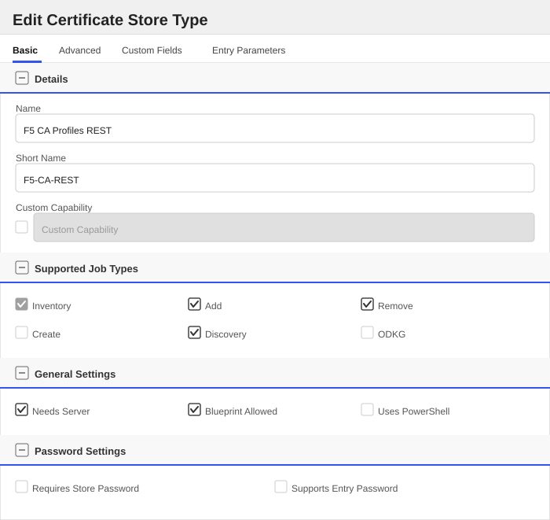

   ##### Advanced Tab
   | Attribute | Value | Description |
   | --------- | ----- | ----- |
   | Supports Custom Alias | Required | Determines if an individual entry within a store can have a custom Alias. |
   | Private Key Handling | Forbidden | This determines if Keyfactor can send the private key associated with a certificate to the store. |
   | PFX Password Style | Default | 'Default' - PFX password is randomly generated, 'Custom' - PFX password may be specified when the enrollment job is created (Requires the Allow Custom Password application setting to be enabled.) |

   The Advanced tab should look like this:

   

   > For Keyfactor **Command versions 24.4 and later**, a Certificate Format dropdown is available with PFX and PEM options. Ensure that **PFX** is selected, as this determines the format of new and renewed certificates sent to the Orchestrator during a Management job. Currently, all Keyfactor-supported Orchestrator extensions support only PFX.

   ##### Custom Fields Tab
   Custom fields operate at the certificate store level and are used to control how the orchestrator connects to the remote target server containing the certificate store to be managed. The following custom fields should be added to the store type:

   | Name | Display Name | Description | Type | Default Value/Options | Required |
   | ---- | ------------ | ---- | --------------------- | -------- | ----------- |
   | PrimaryNode | Primary Node | Only required (and shown) if Primary Node Online Required is added and selected.  Enter the Host Name of the F5 device that acts as the primary node in a highly available F5 implementation. Please note that this value IS case sensitive. | String |  | ✅ Checked |
   | PrimaryNodeCheckRetryWaitSecs | Primary Node Check Retry Wait Seconds | Enter the number of seconds to wait between attempts to add/replace/renew a certificate if the node is inactive. | String | 120 | ✅ Checked |
   | PrimaryNodeCheckRetryMax | Primary Node Check Retry Maximum | Enter the number of times a Management-Add job will attempt to add/replace/renew a certificate if the node is inactive before failing. | String | 3 | ✅ Checked |
   | PrimaryNodeOnlineRequired | Primary Node Online Required | Select this if you wish to stop the orchestrator from adding, replacing or renewing certificates on nodes that are inactive. If this is not selected, adding, replacing and renewing certificates on inactive nodes will be allowed. If you choose not to add this custom field, the default value of False will be assumed. | Bool |  | ✅ Checked |
   | IgnoreSSLWarning | Ignore SSL Warning | Select this if you wish to ignore SSL warnings from F5 that occur during API calls when the site does not have a trusted certificate with the proper SAN bound to it. If you choose not to add this custom field, the default value of False will be assumed and SSL warnings will cause errors during orchestrator extension jobs. | Bool | False | ✅ Checked |
   | UseTokenAuth | Use Token Authentication | Select this if you wish to use F5's token authentiation instead of basic authentication for all API requests. If you choose not to add this custom field, the default value of False will be assumed and basic authentication will be used for all API requests for all jobs. Setting this value to True will enable an initial basic authenticated request to acquire an authentication token, which will then be used for all subsequent API requests. | Bool | false | ✅ Checked |
   | ServerUsername | Server Username | Login credential for the F5 device.  MUST be an Admin account. | Secret |  | 🔲 Unchecked |
   | ServerPassword | Server Password | Login password for the F5 device. | Secret |  | 🔲 Unchecked |
   | ServerUseSsl | Use SSL | True if using https to access the F5 device. False if using http. | Bool | true | ✅ Checked |

   The Custom Fields tab should look like this:

   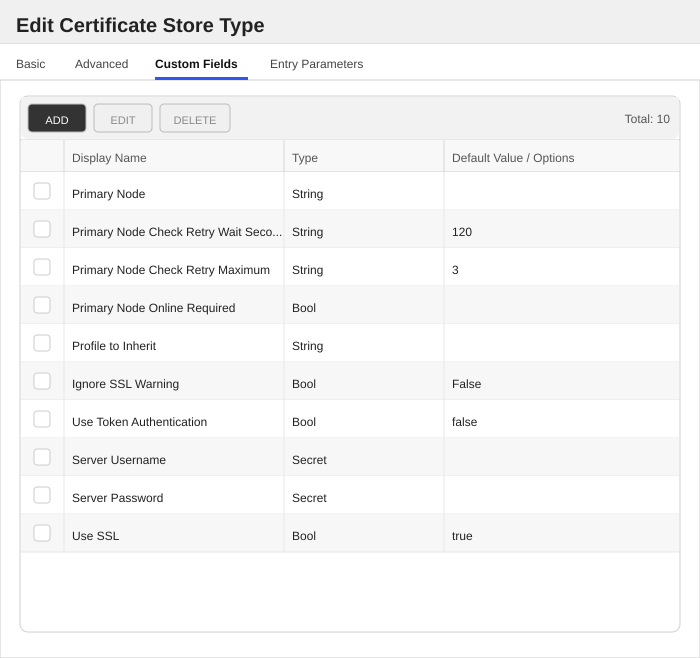

   ###### Primary Node
   Only required (and shown) if Primary Node Online Required is added and selected.  Enter the Host Name of the F5 device that acts as the primary node in a highly available F5 implementation. Please note that this value IS case sensitive.

   
   


   ###### Primary Node Check Retry Wait Seconds
   Enter the number of seconds to wait between attempts to add/replace/renew a certificate if the node is inactive.

   
   


   ###### Primary Node Check Retry Maximum
   Enter the number of times a Management-Add job will attempt to add/replace/renew a certificate if the node is inactive before failing.

   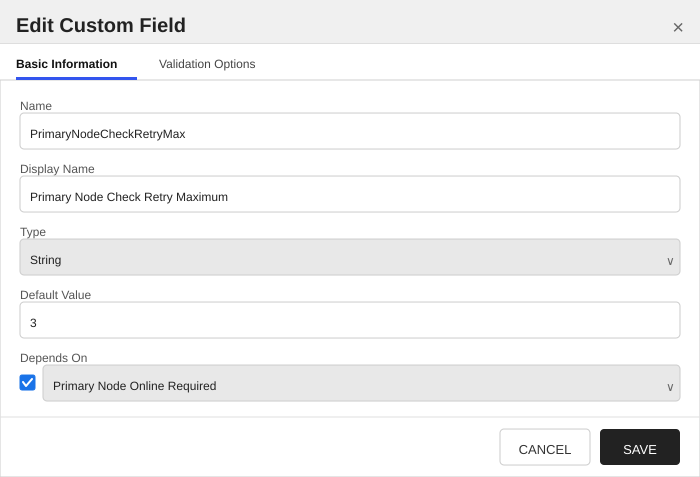
   


   ###### Primary Node Online Required
   Select this if you wish to stop the orchestrator from adding, replacing or renewing certificates on nodes that are inactive. If this is not selected, adding, replacing and renewing certificates on inactive nodes will be allowed. If you choose not to add this custom field, the default value of False will be assumed.

   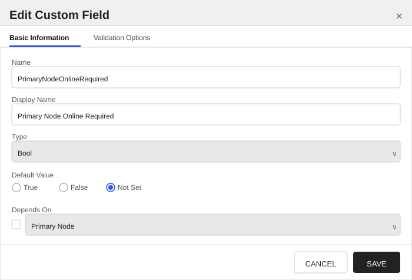
   


   ###### Ignore SSL Warning
   Select this if you wish to ignore SSL warnings from F5 that occur during API calls when the site does not have a trusted certificate with the proper SAN bound to it. If you choose not to add this custom field, the default value of False will be assumed and SSL warnings will cause errors during orchestrator extension jobs.

   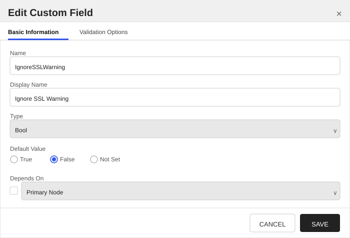
   


   ###### Use Token Authentication
   Select this if you wish to use F5's token authentiation instead of basic authentication for all API requests. If you choose not to add this custom field, the default value of False will be assumed and basic authentication will be used for all API requests for all jobs. Setting this value to True will enable an initial basic authenticated request to acquire an authentication token, which will then be used for all subsequent API requests.

   
   


   ###### Server Username
   Login credential for the F5 device.  MUST be an Admin account.


   > [!IMPORTANT]
   > This field is created by the `Needs Server` on the Basic tab, do not create this field manually.


   ###### Server Password
   Login password for the F5 device.


   > [!IMPORTANT]
   > This field is created by the `Needs Server` on the Basic tab, do not create this field manually.


   ###### Use SSL
   True if using https to access the F5 device. False if using http.

   
   


   </details>
</details>


## Installation

1. **Download the latest F5 Universal Orchestrator extension from GitHub.**

    Navigate to the [F5 Universal Orchestrator extension GitHub version page](https://github.com/Keyfactor/f5-rest-orchestrator/releases/latest). Refer to the compatibility matrix below to determine which asset should be downloaded. Then, click the corresponding asset to download the zip archive.

   | Universal Orchestrator Version | Latest .NET version installed on the Universal Orchestrator server | `rollForward` condition in `Orchestrator.runtimeconfig.json` | `f5-rest-orchestrator` .NET version to download |
   | --------- | ----------- | ----------- | ----------- |
   | Between `11.0.0` and `11.5.1` (inclusive) | `net8.0` | `LatestMajor` | `net8.0` |
   | `11.6` _and_ newer | `net8.0` | | `net8.0` |

    Unzip the archive containing extension assemblies to a known location.

    > **Note** If you don't see an asset with a corresponding .NET version, you should always assume that it was compiled for `net8.0`.

2. **Locate the Universal Orchestrator extensions directory.**

    * **Default on Windows** - `C:\Program Files\Keyfactor\Keyfactor Orchestrator\extensions`
    * **Default on Linux** - `/opt/keyfactor/orchestrator/extensions`

3. **Create a new directory for the F5 Universal Orchestrator extension inside the extensions directory.**

    Create a new directory called `f5-rest-orchestrator`.
    > The directory name does not need to match any names used elsewhere; it just has to be unique within the extensions directory.

4. **Copy the contents of the downloaded and unzipped assemblies from __step 2__ to the `f5-rest-orchestrator` directory.**

5. **Restart the Universal Orchestrator service.**

    Refer to [Starting/Restarting the Universal Orchestrator service](https://software.keyfactor.com/Core-OnPrem/Current/Content/InstallingAgents/NetCoreOrchestrator/StarttheService.htm).

6. **(optional) PAM Integration**

    The F5 Universal Orchestrator extension is compatible with all supported Keyfactor PAM extensions to resolve PAM-eligible secrets. PAM extensions running on Universal Orchestrators enable secure retrieval of secrets from a connected PAM provider.

    To configure a PAM provider, [reference the Keyfactor Integration Catalog](https://keyfactor.github.io/integrations-catalog/content/pam) to select an extension and follow the associated instructions to install it on the Universal Orchestrator (remote).

> The above installation steps can be supplemented by the [official Command documentation](https://software.keyfactor.com/Core-OnPrem/Current/Content/InstallingAgents/NetCoreOrchestrator/CustomExtensions.htm?Highlight=extensions).

## Defining Certificate Stores

The F5 Universal Orchestrator extension implements 3 Certificate Store Types, each of which implements different functionality. Refer to the individual instructions below for each Certificate Store Type that you deemed necessary for your use case from the installation section.

<details><summary>F5 SSL Profiles REST (F5-SL-REST)</summary>

### Store Creation

#### Manually with the Command UI

<details><summary>Click to expand details</summary>

1. **Navigate to the _Certificate Stores_ page in Keyfactor Command.**

    Log into Keyfactor Command, toggle the _Locations_ dropdown, and click _Certificate Stores_.

2. **Add a Certificate Store.**

    Click the Add button to add a new Certificate Store. Use the table below to populate the **Attributes** in the **Add** form.

   | Attribute | Description |
   | --------- | ----------- |
   | Category | Select "F5 SSL Profiles REST" or the customized certificate store name from the previous step. |
   | Container | Optional container to associate certificate store with. |
   | Client Machine | The server name or IP Address for the F5 device. |
   | Store Path | Enter the name of the partition on the F5 device you wish to manage. This value is case sensitive, so if the partition name is "Common", it must be entered as "Common" and not "common", |
   | Store Password | Check "No Password" if you wish the private key of any added certificate to be set to Key Security Type "Normal". Enter a value (either a password or pointer to an installed PAM provider key for the password) to be used to encrypt the private key of any added certificate for Key Security Type of "Password". |
   | Orchestrator | Select an approved orchestrator capable of managing `F5-SL-REST` certificates. Specifically, one with the `F5-SL-REST` capability. |
   | PrimaryNode | Only required (and shown) if Primary Node Online Required is added and selected.  Enter the Host Name of the F5 device that acts as the primary node in a highly available F5 implementation. Please note that this value IS case sensitive. |
   | PrimaryNodeCheckRetryWaitSecs | Enter the number of seconds to wait between attempts to add/replace/renew a certificate if the node is inactive. |
   | PrimaryNodeCheckRetryMax | Enter the number of times a Management-Add job will attempt to add/replace/renew a certificate if the node is inactive before failing. |
   | PrimaryNodeOnlineRequired | Select this if you wish to stop the orchestrator from adding, replacing or renewing certificates on nodes that are inactive. If this is not selected, adding, replacing and renewing certificates on inactive nodes will be allowed. If you choose not to add this custom field, the default value of False will be assumed. |
   | RemoveChain | Optional setting.  Set this to true if you would like to remove the certificate chain before adding or replacing a certificate on your F5 device. |
   | IgnoreSSLWarning | Select this if you wish to ignore SSL warnings from F5 that occur during API calls when the site does not have a trusted certificate with the proper SAN bound to it. If you choose not to add this custom field, the default value of False will be assumed and SSL warnings will cause errors during orchestrator extension jobs. |
   | UseTokenAuth | Select this if you wish to use F5's token authentication instead of basic authentication for all API requests. If you choose not to add this custom field, the default value of False will be assumed and basic authentication will be used for all API requests for all jobs. Setting this value to True will enable an initial basic authenticated request to acquire an authentication token, which will then be used for all subsequent API requests. |
   | SyncDevice | Set this to True if you wish to sync this node to a pre-configured F5 device group.  See [Syncing to Device Group](syncing-to-device-group) for more information on this feature. |
   | SyncDeviceGroup | Enter the name of the pre-configured F5 device group you wish to sync to (valid if SyncDevice = True).  See [Syncing to Device Group](syncing-to-device-group) for more information on this feature. |
   | ServerUsername | Login credential for the F5 device.  MUST be an Admin account. |
   | ServerPassword | Login password for the F5 device. |
   | ServerUseSsl | True if using https to access the F5 device. False if using http. |

</details>

#### Using kfutil CLI

<details><summary>Click to expand details</summary>

1. **Generate a CSV template for the F5-SL-REST certificate store**

    ```shell
    kfutil stores import generate-template --store-type-name F5-SL-REST --outpath F5-SL-REST.csv
    ```
2. **Populate the generated CSV file**

    Open the CSV file, and reference the table below to populate parameters for each **Attribute**.

   | Attribute | Description |
   | --------- | ----------- |
   | Category | Select "F5 SSL Profiles REST" or the customized certificate store name from the previous step. |
   | Container | Optional container to associate certificate store with. |
   | Client Machine | The server name or IP Address for the F5 device. |
   | Store Path | Enter the name of the partition on the F5 device you wish to manage. This value is case sensitive, so if the partition name is "Common", it must be entered as "Common" and not "common", |
   | Store Password | Check "No Password" if you wish the private key of any added certificate to be set to Key Security Type "Normal". Enter a value (either a password or pointer to an installed PAM provider key for the password) to be used to encrypt the private key of any added certificate for Key Security Type of "Password". |
   | Orchestrator | Select an approved orchestrator capable of managing `F5-SL-REST` certificates. Specifically, one with the `F5-SL-REST` capability. |
   | Properties.PrimaryNode | Only required (and shown) if Primary Node Online Required is added and selected.  Enter the Host Name of the F5 device that acts as the primary node in a highly available F5 implementation. Please note that this value IS case sensitive. |
   | Properties.PrimaryNodeCheckRetryWaitSecs | Enter the number of seconds to wait between attempts to add/replace/renew a certificate if the node is inactive. |
   | Properties.PrimaryNodeCheckRetryMax | Enter the number of times a Management-Add job will attempt to add/replace/renew a certificate if the node is inactive before failing. |
   | Properties.PrimaryNodeOnlineRequired | Select this if you wish to stop the orchestrator from adding, replacing or renewing certificates on nodes that are inactive. If this is not selected, adding, replacing and renewing certificates on inactive nodes will be allowed. If you choose not to add this custom field, the default value of False will be assumed. |
   | Properties.RemoveChain | Optional setting.  Set this to true if you would like to remove the certificate chain before adding or replacing a certificate on your F5 device. |
   | Properties.IgnoreSSLWarning | Select this if you wish to ignore SSL warnings from F5 that occur during API calls when the site does not have a trusted certificate with the proper SAN bound to it. If you choose not to add this custom field, the default value of False will be assumed and SSL warnings will cause errors during orchestrator extension jobs. |
   | Properties.UseTokenAuth | Select this if you wish to use F5's token authentication instead of basic authentication for all API requests. If you choose not to add this custom field, the default value of False will be assumed and basic authentication will be used for all API requests for all jobs. Setting this value to True will enable an initial basic authenticated request to acquire an authentication token, which will then be used for all subsequent API requests. |
   | Properties.SyncDevice | Set this to True if you wish to sync this node to a pre-configured F5 device group.  See [Syncing to Device Group](syncing-to-device-group) for more information on this feature. |
   | Properties.SyncDeviceGroup | Enter the name of the pre-configured F5 device group you wish to sync to (valid if SyncDevice = True).  See [Syncing to Device Group](syncing-to-device-group) for more information on this feature. |
   | Properties.ServerUsername | Login credential for the F5 device.  MUST be an Admin account. |
   | Properties.ServerPassword | Login password for the F5 device. |
   | Properties.ServerUseSsl | True if using https to access the F5 device. False if using http. |

3. **Import the CSV file to create the certificate stores**

    ```shell
    kfutil stores import csv --store-type-name F5-SL-REST --file F5-SL-REST.csv
    ```

</details>

#### PAM Provider Eligible Fields
<details><summary>Attributes eligible for retrieval by a PAM Provider on the Universal Orchestrator</summary>

If a PAM provider was installed _on the Universal Orchestrator_ in the [Installation](#Installation) section, the following parameters can be configured for retrieval _on the Universal Orchestrator_.

   | Attribute | Description |
   | --------- | ----------- |
   | ServerUsername | Login credential for the F5 device.  MUST be an Admin account. |
   | ServerPassword | Login password for the F5 device. |
   | StorePassword | Password to use when reading/writing to store |

Please refer to the **Universal Orchestrator (remote)** usage section ([PAM providers on the Keyfactor Integration Catalog](https://keyfactor.github.io/integrations-catalog/content/pam)) for your selected PAM provider for instructions on how to load attributes orchestrator-side.
> Any secret can be rendered by a PAM provider _installed on the Keyfactor Command server_. The above parameters are specific to attributes that can be fetched by an installed PAM provider running on the Universal Orchestrator server itself.

</details>

> The content in this section can be supplemented by the [official Command documentation](https://software.keyfactor.com/Core-OnPrem/Current/Content/ReferenceGuide/Certificate%20Stores.htm?Highlight=certificate%20store).

</details>

<details><summary>F5 WS Profiles REST (F5-WS-REST)</summary>

### Store Creation

#### Manually with the Command UI

<details><summary>Click to expand details</summary>

1. **Navigate to the _Certificate Stores_ page in Keyfactor Command.**

    Log into Keyfactor Command, toggle the _Locations_ dropdown, and click _Certificate Stores_.

2. **Add a Certificate Store.**

    Click the Add button to add a new Certificate Store. Use the table below to populate the **Attributes** in the **Add** form.

   | Attribute | Description |
   | --------- | ----------- |
   | Category | Select "F5 WS Profiles REST" or the customized certificate store name from the previous step. |
   | Container | Optional container to associate certificate store with. |
   | Client Machine | The server name or IP Address for the F5 device. |
   | Store Path | Enter the name of the partition on the F5 device you wish to manage. This value is case sensitive, so if the partition name is "Common", it must be entered as "Common" and not "common", |
   | Orchestrator | Select an approved orchestrator capable of managing `F5-WS-REST` certificates. Specifically, one with the `F5-WS-REST` capability. |
   | PrimaryNode | Only required (and shown) if Primary Node Online Required is added and selected.  Enter the Host Name of the F5 device that acts as the primary node in a highly available F5 implementation. Please note that this value IS case sensitive. |
   | PrimaryNodeCheckRetryWaitSecs | Enter the number of seconds to wait between attempts to add/replace/renew a certificate if the node is inactive. |
   | PrimaryNodeCheckRetryMax | Enter the number of times a Management-Add job will attempt to add/replace/renew a certificate if the node is inactive before failing. |
   | PrimaryNodeOnlineRequired | Select this if you wish to stop the orchestrator from adding, replacing or renewing certificates on nodes that are inactive. If this is not selected, adding, replacing and renewing certificates on inactive nodes will be allowed. If you choose not to add this custom field, the default value of False will be assumed. |
   | IgnoreSSLWarning | Select this if you wish to ignore SSL warnings from F5 that occur during API calls when the site does not have a trusted certificate with the proper SAN bound to it. If you choose not to add this custom field, the default value of False will be assumed and SSL warnings will cause errors during orchestrator extension jobs. |
   | UseTokenAuth | Select this if you wish to use F5's token authentiation instead of basic authentication for all API requests. If you choose not to add this custom field, the default value of False will be assumed and basic authentication will be used for all API requests for all jobs. Setting this value to True will enable an initial basic authenticated request to acquire an authentication token, which will then be used for all subsequent API requests. |
   | ServerUsername | Login credential for the F5 device.  MUST be an Admin account. |
   | ServerPassword | Login password for the F5 device. |
   | ServerUseSsl | True if using https to access the F5 device. False if using http. |

</details>

#### Using kfutil CLI

<details><summary>Click to expand details</summary>

1. **Generate a CSV template for the F5-WS-REST certificate store**

    ```shell
    kfutil stores import generate-template --store-type-name F5-WS-REST --outpath F5-WS-REST.csv
    ```
2. **Populate the generated CSV file**

    Open the CSV file, and reference the table below to populate parameters for each **Attribute**.

   | Attribute | Description |
   | --------- | ----------- |
   | Category | Select "F5 WS Profiles REST" or the customized certificate store name from the previous step. |
   | Container | Optional container to associate certificate store with. |
   | Client Machine | The server name or IP Address for the F5 device. |
   | Store Path | Enter the name of the partition on the F5 device you wish to manage. This value is case sensitive, so if the partition name is "Common", it must be entered as "Common" and not "common", |
   | Orchestrator | Select an approved orchestrator capable of managing `F5-WS-REST` certificates. Specifically, one with the `F5-WS-REST` capability. |
   | Properties.PrimaryNode | Only required (and shown) if Primary Node Online Required is added and selected.  Enter the Host Name of the F5 device that acts as the primary node in a highly available F5 implementation. Please note that this value IS case sensitive. |
   | Properties.PrimaryNodeCheckRetryWaitSecs | Enter the number of seconds to wait between attempts to add/replace/renew a certificate if the node is inactive. |
   | Properties.PrimaryNodeCheckRetryMax | Enter the number of times a Management-Add job will attempt to add/replace/renew a certificate if the node is inactive before failing. |
   | Properties.PrimaryNodeOnlineRequired | Select this if you wish to stop the orchestrator from adding, replacing or renewing certificates on nodes that are inactive. If this is not selected, adding, replacing and renewing certificates on inactive nodes will be allowed. If you choose not to add this custom field, the default value of False will be assumed. |
   | Properties.IgnoreSSLWarning | Select this if you wish to ignore SSL warnings from F5 that occur during API calls when the site does not have a trusted certificate with the proper SAN bound to it. If you choose not to add this custom field, the default value of False will be assumed and SSL warnings will cause errors during orchestrator extension jobs. |
   | Properties.UseTokenAuth | Select this if you wish to use F5's token authentiation instead of basic authentication for all API requests. If you choose not to add this custom field, the default value of False will be assumed and basic authentication will be used for all API requests for all jobs. Setting this value to True will enable an initial basic authenticated request to acquire an authentication token, which will then be used for all subsequent API requests. |
   | Properties.ServerUsername | Login credential for the F5 device.  MUST be an Admin account. |
   | Properties.ServerPassword | Login password for the F5 device. |
   | Properties.ServerUseSsl | True if using https to access the F5 device. False if using http. |

3. **Import the CSV file to create the certificate stores**

    ```shell
    kfutil stores import csv --store-type-name F5-WS-REST --file F5-WS-REST.csv
    ```

</details>

#### PAM Provider Eligible Fields
<details><summary>Attributes eligible for retrieval by a PAM Provider on the Universal Orchestrator</summary>

If a PAM provider was installed _on the Universal Orchestrator_ in the [Installation](#Installation) section, the following parameters can be configured for retrieval _on the Universal Orchestrator_.

   | Attribute | Description |
   | --------- | ----------- |
   | ServerUsername | Login credential for the F5 device.  MUST be an Admin account. |
   | ServerPassword | Login password for the F5 device. |

Please refer to the **Universal Orchestrator (remote)** usage section ([PAM providers on the Keyfactor Integration Catalog](https://keyfactor.github.io/integrations-catalog/content/pam)) for your selected PAM provider for instructions on how to load attributes orchestrator-side.
> Any secret can be rendered by a PAM provider _installed on the Keyfactor Command server_. The above parameters are specific to attributes that can be fetched by an installed PAM provider running on the Universal Orchestrator server itself.

</details>

> The content in this section can be supplemented by the [official Command documentation](https://software.keyfactor.com/Core-OnPrem/Current/Content/ReferenceGuide/Certificate%20Stores.htm?Highlight=certificate%20store).

</details>

<details><summary>F5 CA Profiles REST (F5-CA-REST)</summary>

### Store Creation

#### Manually with the Command UI

<details><summary>Click to expand details</summary>

1. **Navigate to the _Certificate Stores_ page in Keyfactor Command.**

    Log into Keyfactor Command, toggle the _Locations_ dropdown, and click _Certificate Stores_.

2. **Add a Certificate Store.**

    Click the Add button to add a new Certificate Store. Use the table below to populate the **Attributes** in the **Add** form.

   | Attribute | Description |
   | --------- | ----------- |
   | Category | Select "F5 CA Profiles REST" or the customized certificate store name from the previous step. |
   | Container | Optional container to associate certificate store with. |
   | Client Machine | The server name or IP Address for the F5 device. |
   | Store Path | Enter the name of the partition followed by the name of the bundle separated by a / (i.e. Common/BundleName). This value is case sensitive, so if the partition name is "Common/BundleName", it must be entered as "Common/BundleName" and not "common/bundlename", |
   | Orchestrator | Select an approved orchestrator capable of managing `F5-CA-REST` certificates. Specifically, one with the `F5-CA-REST` capability. |
   | PrimaryNode | Only required (and shown) if Primary Node Online Required is added and selected.  Enter the Host Name of the F5 device that acts as the primary node in a highly available F5 implementation. Please note that this value IS case sensitive. |
   | PrimaryNodeCheckRetryWaitSecs | Enter the number of seconds to wait between attempts to add/replace/renew a certificate if the node is inactive. |
   | PrimaryNodeCheckRetryMax | Enter the number of times a Management-Add job will attempt to add/replace/renew a certificate if the node is inactive before failing. |
   | PrimaryNodeOnlineRequired | Select this if you wish to stop the orchestrator from adding, replacing or renewing certificates on nodes that are inactive. If this is not selected, adding, replacing and renewing certificates on inactive nodes will be allowed. If you choose not to add this custom field, the default value of False will be assumed. |
   | IgnoreSSLWarning | Select this if you wish to ignore SSL warnings from F5 that occur during API calls when the site does not have a trusted certificate with the proper SAN bound to it. If you choose not to add this custom field, the default value of False will be assumed and SSL warnings will cause errors during orchestrator extension jobs. |
   | UseTokenAuth | Select this if you wish to use F5's token authentiation instead of basic authentication for all API requests. If you choose not to add this custom field, the default value of False will be assumed and basic authentication will be used for all API requests for all jobs. Setting this value to True will enable an initial basic authenticated request to acquire an authentication token, which will then be used for all subsequent API requests. |
   | ServerUsername | Login credential for the F5 device.  MUST be an Admin account. |
   | ServerPassword | Login password for the F5 device. |
   | ServerUseSsl | True if using https to access the F5 device. False if using http. |

</details>

#### Using kfutil CLI

<details><summary>Click to expand details</summary>

1. **Generate a CSV template for the F5-CA-REST certificate store**

    ```shell
    kfutil stores import generate-template --store-type-name F5-CA-REST --outpath F5-CA-REST.csv
    ```
2. **Populate the generated CSV file**

    Open the CSV file, and reference the table below to populate parameters for each **Attribute**.

   | Attribute | Description |
   | --------- | ----------- |
   | Category | Select "F5 CA Profiles REST" or the customized certificate store name from the previous step. |
   | Container | Optional container to associate certificate store with. |
   | Client Machine | The server name or IP Address for the F5 device. |
   | Store Path | Enter the name of the partition followed by the name of the bundle separated by a / (i.e. Common/BundleName). This value is case sensitive, so if the partition name is "Common/BundleName", it must be entered as "Common/BundleName" and not "common/bundlename", |
   | Orchestrator | Select an approved orchestrator capable of managing `F5-CA-REST` certificates. Specifically, one with the `F5-CA-REST` capability. |
   | Properties.PrimaryNode | Only required (and shown) if Primary Node Online Required is added and selected.  Enter the Host Name of the F5 device that acts as the primary node in a highly available F5 implementation. Please note that this value IS case sensitive. |
   | Properties.PrimaryNodeCheckRetryWaitSecs | Enter the number of seconds to wait between attempts to add/replace/renew a certificate if the node is inactive. |
   | Properties.PrimaryNodeCheckRetryMax | Enter the number of times a Management-Add job will attempt to add/replace/renew a certificate if the node is inactive before failing. |
   | Properties.PrimaryNodeOnlineRequired | Select this if you wish to stop the orchestrator from adding, replacing or renewing certificates on nodes that are inactive. If this is not selected, adding, replacing and renewing certificates on inactive nodes will be allowed. If you choose not to add this custom field, the default value of False will be assumed. |
   | Properties.IgnoreSSLWarning | Select this if you wish to ignore SSL warnings from F5 that occur during API calls when the site does not have a trusted certificate with the proper SAN bound to it. If you choose not to add this custom field, the default value of False will be assumed and SSL warnings will cause errors during orchestrator extension jobs. |
   | Properties.UseTokenAuth | Select this if you wish to use F5's token authentiation instead of basic authentication for all API requests. If you choose not to add this custom field, the default value of False will be assumed and basic authentication will be used for all API requests for all jobs. Setting this value to True will enable an initial basic authenticated request to acquire an authentication token, which will then be used for all subsequent API requests. |
   | Properties.ServerUsername | Login credential for the F5 device.  MUST be an Admin account. |
   | Properties.ServerPassword | Login password for the F5 device. |
   | Properties.ServerUseSsl | True if using https to access the F5 device. False if using http. |

3. **Import the CSV file to create the certificate stores**

    ```shell
    kfutil stores import csv --store-type-name F5-CA-REST --file F5-CA-REST.csv
    ```

</details>

#### PAM Provider Eligible Fields
<details><summary>Attributes eligible for retrieval by a PAM Provider on the Universal Orchestrator</summary>

If a PAM provider was installed _on the Universal Orchestrator_ in the [Installation](#Installation) section, the following parameters can be configured for retrieval _on the Universal Orchestrator_.

   | Attribute | Description |
   | --------- | ----------- |
   | ServerUsername | Login credential for the F5 device.  MUST be an Admin account. |
   | ServerPassword | Login password for the F5 device. |

Please refer to the **Universal Orchestrator (remote)** usage section ([PAM providers on the Keyfactor Integration Catalog](https://keyfactor.github.io/integrations-catalog/content/pam)) for your selected PAM provider for instructions on how to load attributes orchestrator-side.
> Any secret can be rendered by a PAM provider _installed on the Keyfactor Command server_. The above parameters are specific to attributes that can be fetched by an installed PAM provider running on the Universal Orchestrator server itself.

</details>

> The content in this section can be supplemented by the [official Command documentation](https://software.keyfactor.com/Core-OnPrem/Current/Content/ReferenceGuide/Certificate%20Stores.htm?Highlight=certificate%20store).

</details>

## Discovering Certificate Stores with the Discovery Job

For SSL Certificate (F5-SL-REST) and CA Bundle (F5-CA-REST) store types, discovery jobs can be scheduled to find F5 partitions that can be configured as Keyfactor Command certificate stores.

First, in Keyfactor Command navigate to Certificate Locations =\> Certificate Stores. Select the Discover tab and then the Schedule button. Complete the dialog and click Done to schedule.
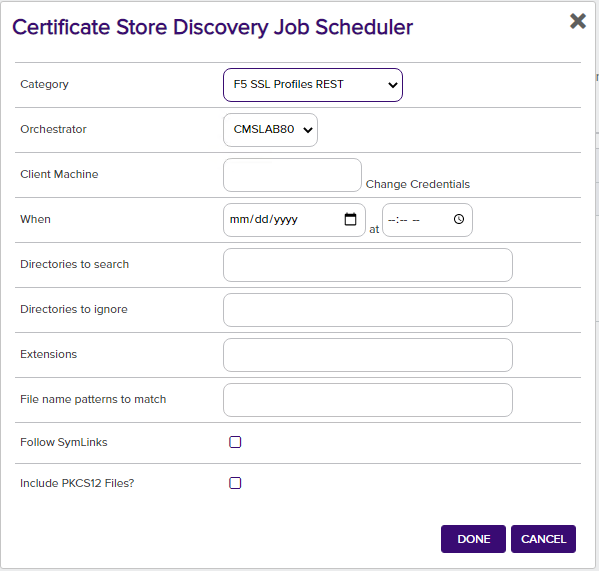

- **Category** - Required. The F5 store type you wish to find stores for.

- **Orchestrator** - Select the orchestrator you wish to use to manage this store

- **Client Machine & Credentials** - Required.  The server name or IP Address and login credentials for the F5 device.  The credentials for server login can be any of:

  - UserId/Password
  - PAM provider information to pass the UserId/Password or UserId/SSH private key credentials
  
  When entering the credentials, UseSSL ***must*** be selected.
  
- **When** - Required. The date and time when you would like this to execute.

- **Directories to search** - Required but not used. This field is not used in the search to Discover certificate stores, but ***is*** a required field in this dialog, so just enter any value.  It will not be used.

- **Directories to ignore/Extensions/File name patterns to match/Follow SymLinks/Include PKCS12 Files** - Not used.  Leave blank.

Once the Discovery job has completed, a list of F5 certificate store locations should show in the Certificate Stores Discovery tab in Keyfactor Command. Right click on a store and select Approve to bring up a dialog that will ask for the remaining necessary certificate store parameters described in Step 2a.  Complete those and click Save, and the Certificate Store should now show up in the list of stores in the Certificate Stores tab.


## Syncing To Device Group

The "Sync To Device Group" feature added in version 2.0 of the this orchestrator extension allows for syncing the F5 Big IP node being managed by the Keyfactor Command certificate store to a secondary node defined in the F5 device group referenced in the 
related "Device Group" certificate store setting.  The F5 Big IP prerequisite tasks that need to be performed to set up the device group that will support syncing are as follows:

### 1. Network Foundation (both devices)
Each device needs a **Self IP** — a non-management IP address on a shared data-plane network that both devices can reach. This is the address BIG-IP uses for sync traffic. Both Self IPs must be on the same subnet so they can communicate with each other.

### 2. ConfigSync Address (both devices)
Each device must be told which of its Self IPs to use for synchronization traffic. This is set independently on each device and must point to the Self IP created in step 1 — not the management IP.

### 3. Device Trust (primary only)
Before devices can sync, they must establish a cryptographic trust relationship. This is initiated from the primary device by providing the peer's IP address and credentials. Once established, both devices recognize each other as trusted peers. This is a one-time setup and automatically applies to both devices simultaneously.

### 4. Device Group (primary only)
Once trust is established, a device group is created on the primary and both devices are added as members. The device group defines:
- **Type** — Sync-Failover (syncs config and enables failover) or Sync-Only (config sync without failover)
- **Members** — which devices participate
- **Sync behavior** — automatic or manual

The device group automatically appears on the secondary once created on the primary.

### Dependencies Summary

```
Self IPs (both)
    └── ConfigSync Address (both)
            └── Device Trust (primary → auto both)
                    └── Device Group (primary → auto both)
```

Each layer depends on the one above it being in place before it can be configured.

## License

Apache License 2.0, see [LICENSE](LICENSE).

## Related Integrations

See all [Keyfactor Universal Orchestrator extensions](https://github.com/orgs/Keyfactor/repositories?q=orchestrator).
