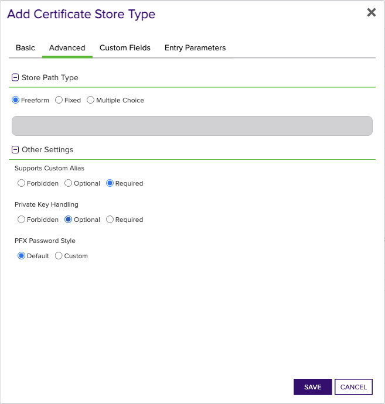

<h1 align="center" style="border-bottom: none">
    F5 Universal Orchestrator Extension
</h1>

<p align="center">
  <!-- Badges -->

<a href="https://github.com/Keyfactor/f5-rest-orchestrator/releases"></a>


</p>

<p align="center">
  <!-- TOC -->
  <a href="#support">
    <b>Support</b>
  </a>
  ·
  <a href="#installation">
    <b>Installation</b>
  </a>
  ·
  <a href="#license">
    <b>License</b>
  </a>
  ·
  <a href="https://github.com/orgs/Keyfactor/repositories?q=orchestrator">
    <b>Related Integrations</b>
  </a>
</p>

## Overview

The F5 Orchestrator supports three different types of certificates stores with the capabilities for each below:

- CA Bundles
  - Discovery
  - Inventory*
  - Management (Add and Remove)
- Web Server Device Certificates
  - Inventory*
  - Management (Add, but replacement/renewal of existing certificate only) 
- SSL Certificates
  - Discovery
  - Inventory*
  - Management (Add and Remove)  

*Special note on private keys: One of the pieces of information that Keyfactor collects during an Inventory job is whether or not the certificate stored in F5 has a private key.  The private key is NEVER actually retrieved by Keyfactor, but Keyfactor does track whether one exists.  F5 does not provide an API to determine this, so by convention, all CA Bundle certificates are deemed to not have private keys, while Web Server and SSL certificates are deemed to have them.  Any Management jobs adding (new or renewal) a certificate will renew without the private key for CA Bundle stores and with the private key for Web Server or SSL stores.

The F5 Universal Orchestrator extension implements 3 Certificate Store Types. Depending on your use case, you may elect to use one, or all of these Certificate Store Types. Descriptions of each are provided below.


## Compatibility

This integration is compatible with Keyfactor Universal Orchestrator version 10.1 and later.

## Support
The F5 Universal Orchestrator extension If you have a support issue, please open a support ticket by either contacting your Keyfactor representative or via the Keyfactor Support Portal at https://support.keyfactor.com. 
 
> To report a problem or suggest a new feature, use the **[Issues](../../issues)** tab. If you want to contribute actual bug fixes or proposed enhancements, use the **[Pull requests](../../pulls)** tab.

## Requirements & Prerequisites

Before installing the F5 Universal Orchestrator extension, we recommend that you install [kfutil](https://github.com/Keyfactor/kfutil). Kfutil is a command-line tool that simplifies the process of creating store types, installing extensions, and instantiating certificate stores in Keyfactor Command.


An administrator account must be set up in F5 to be used with this orchestrator extension.  This F5 user id is what must be used as credentials when setting up a Keyfactor Command certificate store pointing to the F5 device intending to be managed.


## Create Certificate Store Types

To use the F5 Universal Orchestrator extension, you **must** create the Certificate Store Types required for your usecase. This only needs to happen _once_ per Keyfactor Command instance.

The F5 Universal Orchestrator extension implements 3 Certificate Store Types. Depending on your use case, you may elect to use one, or all of these Certificate Store Types.

<details><summary>F5 SSL Profiles REST (F5-SL-REST)</summary>


### Using kfutil:

#### Using online definition from GitHub:
This will reach out to GitHub and pull the latest store-type definition
```shell
# F5 SSL Profiles REST
kfutil store-types create F5-SL-REST
```

#### Offline creation using integration-manifest file:
If required, it is possible to create store types from the [integration-manifest.json](./integration-manifest.json) included in this repo.
```shell
kfutil store-types create --from-file integration-manifest.json
```

### Manually
* **Create F5-SL-REST manually in the Command UI**:
    <details><summary>Create F5-SL-REST manually in the Command UI</summary>

    Create a store type called `F5-SL-REST` with the attributes in the tables below:

    #### Basic Tab
    | Attribute | Value | Description |
    | --------- | ----- | ----- |
    | Name | F5 SSL Profiles REST | Display name for the store type (may be customized) |
    | Short Name | F5-SL-REST | Short display name for the store type |
    | Capability | F5-SL-REST | Store type name orchestrator will register with. Check the box to allow entry of value |
    | Supports Add | ✅ Checked | Check the box. Indicates that the Store Type supports Management Add |
    | Supports Remove | ✅ Checked | Check the box. Indicates that the Store Type supports Management Remove |
    | Supports Discovery | ✅ Checked | Check the box. Indicates that the Store Type supports Discovery |
    | Supports Reenrollment | 🔲 Unchecked |  Indicates that the Store Type supports Reenrollment |
    | Supports Create | 🔲 Unchecked |  Indicates that the Store Type supports store creation |
    | Needs Server | ✅ Checked | Determines if a target server name is required when creating store |
    | Blueprint Allowed | ✅ Checked | Determines if store type may be included in an Orchestrator blueprint |
    | Uses PowerShell | 🔲 Unchecked | Determines if underlying implementation is PowerShell |
    | Requires Store Password | ✅ Checked | Enables users to optionally specify a store password when defining a Certificate Store. |
    | Supports Entry Password | 🔲 Unchecked | Determines if an individual entry within a store can have a password. |

    The Basic tab should look like this:

    

    #### Advanced Tab
    | Attribute | Value | Description |
    | --------- | ----- | ----- |
    | Supports Custom Alias | Required | Determines if an individual entry within a store can have a custom Alias. |
    | Private Key Handling | Optional | This determines if Keyfactor can send the private key associated with a certificate to the store. Required because IIS certificates without private keys would be invalid. |
    | PFX Password Style | Default | 'Default' - PFX password is randomly generated, 'Custom' - PFX password may be specified when the enrollment job is created (Requires the Allow Custom Password application setting to be enabled.) |

    The Advanced tab should look like this:

    

    > For Keyfactor **Command versions 24.4 and later**, a Certificate Format dropdown is available with PFX and PEM options. Ensure that **PFX** is selected, as this determines the format of new and renewed certificates sent to the Orchestrator during a Management job. Currently, all Keyfactor-supported Orchestrator extensions support only PFX.

    #### Custom Fields Tab
    Custom fields operate at the certificate store level and are used to control how the orchestrator connects to the remote target server containing the certificate store to be managed. The following custom fields should be added to the store type:

    | Name | Display Name | Description | Type | Default Value/Options | Required |
    | ---- | ------------ | ---- | --------------------- | -------- | ----------- |
    | PrimaryNode | Primary Node | Only required (and shown) if Primary Node Online Required is added and selected.  Enter the Host Name of the F5 device that acts as the primary node in a highly available F5 implementation. Please note that this value IS case sensitive. | String |  | ✅ Checked |
    | PrimaryNodeCheckRetryWaitSecs | Primary Node Check Retry Wait Seconds | Enter the number of seconds to wait between attempts to add/replace/renew a certificate if the node is inactive. | String | 120 | ✅ Checked |
    | PrimaryNodeCheckRetryMax | Primary Node Check Retry Maximum | Enter the number of times a Management-Add job will attempt to add/replace/renew a certificate if the node is inactive before failing. | String | 3 | ✅ Checked |
    | PrimaryNodeOnlineRequired | Primary Node Online Required | Select this if you wish to stop the orchestrator from adding, replacing or renewing certificates on nodes that are inactive. If this is not selected, adding, replacing and renewing certificates on inactive nodes will be allowed. If you choose not to add this custom field, the default value of False will be assumed. | Bool |  | ✅ Checked |
    | RemoveChain | Remove Chain on Add | Optional setting.  Set this to true if you would like to remove the certificate chain before adding or replacing a certificate on your F5 device. | Bool | False | 🔲 Unchecked |
    | IgnoreSSLWarning | Ignore SSL Warning | Select this if you wish to ignore SSL warnings from F5 that occur during API calls when the site does not have a trusted certificate with the proper SAN bound to it. If you choose not to add this custom field, the default value of False will be assumed and SSL warnings will cause errors during orchestrator extension jobs. | Bool | False | ✅ Checked |
    | UseTokenAuth | Use Token Authentication | Select this if you wish to use F5's token authentication instead of basic authentication for all API requests. If you choose not to add this custom field, the default value of False will be assumed and basic authentication will be used for all API requests for all jobs. Setting this value to True will enable an initial basic authenticated request to acquire an authentication token, which will then be used for all subsequent API requests. | Bool | false | ✅ Checked |
    | ServerUsername | Server Username | Login credential for the F5 device.  MUST be an Admin account. | Secret |  | 🔲 Unchecked |
    | ServerPassword | Server Password | Login password for the F5 device. | Secret |  | 🔲 Unchecked |
    | ServerUseSsl | Use SSL | True if using https to access the F5 device. False if using http. | Bool | true | ✅ Checked |

    The Custom Fields tab should look like this:

    


</details>

<details><summary>F5 WS Profiles REST (F5-WS-REST)</summary>


### Using kfutil:

#### Using online definition from GitHub:
This will reach out to GitHub and pull the latest store-type definition
```shell
# F5 WS Profiles REST
kfutil store-types create F5-WS-REST
```

#### Offline creation using integration-manifest file:
If required, it is possible to create store types from the [integration-manifest.json](./integration-manifest.json) included in this repo.
```shell
kfutil store-types create --from-file integration-manifest.json
```

### Manually
* **Create F5-WS-REST manually in the Command UI**:
    <details><summary>Create F5-WS-REST manually in the Command UI</summary>

    Create a store type called `F5-WS-REST` with the attributes in the tables below:

    #### Basic Tab
    | Attribute | Value | Description |
    | --------- | ----- | ----- |
    | Name | F5 WS Profiles REST | Display name for the store type (may be customized) |
    | Short Name | F5-WS-REST | Short display name for the store type |
    | Capability | F5-WS-REST | Store type name orchestrator will register with. Check the box to allow entry of value |
    | Supports Add | ✅ Checked | Check the box. Indicates that the Store Type supports Management Add |
    | Supports Remove | 🔲 Unchecked |  Indicates that the Store Type supports Management Remove |
    | Supports Discovery | 🔲 Unchecked |  Indicates that the Store Type supports Discovery |
    | Supports Reenrollment | 🔲 Unchecked |  Indicates that the Store Type supports Reenrollment |
    | Supports Create | 🔲 Unchecked |  Indicates that the Store Type supports store creation |
    | Needs Server | ✅ Checked | Determines if a target server name is required when creating store |
    | Blueprint Allowed | ✅ Checked | Determines if store type may be included in an Orchestrator blueprint |
    | Uses PowerShell | 🔲 Unchecked | Determines if underlying implementation is PowerShell |
    | Requires Store Password | 🔲 Unchecked | Enables users to optionally specify a store password when defining a Certificate Store. |
    | Supports Entry Password | 🔲 Unchecked | Determines if an individual entry within a store can have a password. |

    The Basic tab should look like this:

    

    #### Advanced Tab
    | Attribute | Value | Description |
    | --------- | ----- | ----- |
    | Supports Custom Alias | Forbidden | Determines if an individual entry within a store can have a custom Alias. |
    | Private Key Handling | Required | This determines if Keyfactor can send the private key associated with a certificate to the store. Required because IIS certificates without private keys would be invalid. |
    | PFX Password Style | Default | 'Default' - PFX password is randomly generated, 'Custom' - PFX password may be specified when the enrollment job is created (Requires the Allow Custom Password application setting to be enabled.) |

    The Advanced tab should look like this:

    

    > For Keyfactor **Command versions 24.4 and later**, a Certificate Format dropdown is available with PFX and PEM options. Ensure that **PFX** is selected, as this determines the format of new and renewed certificates sent to the Orchestrator during a Management job. Currently, all Keyfactor-supported Orchestrator extensions support only PFX.

    #### Custom Fields Tab
    Custom fields operate at the certificate store level and are used to control how the orchestrator connects to the remote target server containing the certificate store to be managed. The following custom fields should be added to the store type:

    | Name | Display Name | Description | Type | Default Value/Options | Required |
    | ---- | ------------ | ---- | --------------------- | -------- | ----------- |
    | PrimaryNode | Primary Node | Only required (and shown) if Primary Node Online Required is added and selected.  Enter the Host Name of the F5 device that acts as the primary node in a highly available F5 implementation. Please note that this value IS case sensitive. | String |  | ✅ Checked |
    | PrimaryNodeCheckRetryWaitSecs | Primary Node Check Retry Wait Seconds | Enter the number of seconds to wait between attempts to add/replace/renew a certificate if the node is inactive. | String | 120 | ✅ Checked |
    | PrimaryNodeCheckRetryMax | Primary Node Check Retry Maximum | Enter the number of times a Management-Add job will attempt to add/replace/renew a certificate if the node is inactive before failing. | String | 3 | ✅ Checked |
    | PrimaryNodeOnlineRequired | Primary Node Online Required | Select this if you wish to stop the orchestrator from adding, replacing or renewing certificates on nodes that are inactive. If this is not selected, adding, replacing and renewing certificates on inactive nodes will be allowed. If you choose not to add this custom field, the default value of False will be assumed. | Bool |  | ✅ Checked |
    | IgnoreSSLWarning | Ignore SSL Warning | Select this if you wish to ignore SSL warnings from F5 that occur during API calls when the site does not have a trusted certificate with the proper SAN bound to it. If you choose not to add this custom field, the default value of False will be assumed and SSL warnings will cause errors during orchestrator extension jobs. | Bool | False | ✅ Checked |
    | UseTokenAuth | Use Token Authentication | Select this if you wish to use F5's token authentiation instead of basic authentication for all API requests. If you choose not to add this custom field, the default value of False will be assumed and basic authentication will be used for all API requests for all jobs. Setting this value to True will enable an initial basic authenticated request to acquire an authentication token, which will then be used for all subsequent API requests. | Bool | false | ✅ Checked |
    | ServerUsername | Server Username | Login credential for the F5 device.  MUST be an Admin account. | Secret |  | 🔲 Unchecked |
    | ServerPassword | Server Password | Login password for the F5 device. | Secret |  | 🔲 Unchecked |
    | ServerUseSsl | Use SSL | True if using https to access the F5 device. False if using http. | Bool | true | ✅ Checked |

    The Custom Fields tab should look like this:

    


</details>

<details><summary>F5 CA Profiles REST (F5-CA-REST)</summary>


### Using kfutil:

#### Using online definition from GitHub:
This will reach out to GitHub and pull the latest store-type definition
```shell
# F5 CA Profiles REST
kfutil store-types create F5-CA-REST
```

#### Offline creation using integration-manifest file:
If required, it is possible to create store types from the [integration-manifest.json](./integration-manifest.json) included in this repo.
```shell
kfutil store-types create --from-file integration-manifest.json
```

### Manually
* **Create F5-CA-REST manually in the Command UI**:
    <details><summary>Create F5-CA-REST manually in the Command UI</summary>

    Create a store type called `F5-CA-REST` with the attributes in the tables below:

    #### Basic Tab
    | Attribute | Value | Description |
    | --------- | ----- | ----- |
    | Name | F5 CA Profiles REST | Display name for the store type (may be customized) |
    | Short Name | F5-CA-REST | Short display name for the store type |
    | Capability | F5-CA-REST | Store type name orchestrator will register with. Check the box to allow entry of value |
    | Supports Add | ✅ Checked | Check the box. Indicates that the Store Type supports Management Add |
    | Supports Remove | ✅ Checked | Check the box. Indicates that the Store Type supports Management Remove |
    | Supports Discovery | ✅ Checked | Check the box. Indicates that the Store Type supports Discovery |
    | Supports Reenrollment | 🔲 Unchecked |  Indicates that the Store Type supports Reenrollment |
    | Supports Create | 🔲 Unchecked |  Indicates that the Store Type supports store creation |
    | Needs Server | ✅ Checked | Determines if a target server name is required when creating store |
    | Blueprint Allowed | ✅ Checked | Determines if store type may be included in an Orchestrator blueprint |
    | Uses PowerShell | 🔲 Unchecked | Determines if underlying implementation is PowerShell |
    | Requires Store Password | 🔲 Unchecked | Enables users to optionally specify a store password when defining a Certificate Store. |
    | Supports Entry Password | 🔲 Unchecked | Determines if an individual entry within a store can have a password. |

    The Basic tab should look like this:

    

    #### Advanced Tab
    | Attribute | Value | Description |
    | --------- | ----- | ----- |
    | Supports Custom Alias | Required | Determines if an individual entry within a store can have a custom Alias. |
    | Private Key Handling | Forbidden | This determines if Keyfactor can send the private key associated with a certificate to the store. Required because IIS certificates without private keys would be invalid. |
    | PFX Password Style | Default | 'Default' - PFX password is randomly generated, 'Custom' - PFX password may be specified when the enrollment job is created (Requires the Allow Custom Password application setting to be enabled.) |

    The Advanced tab should look like this:

    

    > For Keyfactor **Command versions 24.4 and later**, a Certificate Format dropdown is available with PFX and PEM options. Ensure that **PFX** is selected, as this determines the format of new and renewed certificates sent to the Orchestrator during a Management job. Currently, all Keyfactor-supported Orchestrator extensions support only PFX.

    #### Custom Fields Tab
    Custom fields operate at the certificate store level and are used to control how the orchestrator connects to the remote target server containing the certificate store to be managed. The following custom fields should be added to the store type:

    | Name | Display Name | Description | Type | Default Value/Options | Required |
    | ---- | ------------ | ---- | --------------------- | -------- | ----------- |
    | PrimaryNode | Primary Node | Only required (and shown) if Primary Node Online Required is added and selected.  Enter the Host Name of the F5 device that acts as the primary node in a highly available F5 implementation. Please note that this value IS case sensitive. | String |  | ✅ Checked |
    | PrimaryNodeCheckRetryWaitSecs | Primary Node Check Retry Wait Seconds | Enter the number of seconds to wait between attempts to add/replace/renew a certificate if the node is inactive. | String | 120 | ✅ Checked |
    | PrimaryNodeCheckRetryMax | Primary Node Check Retry Maximum | Enter the number of times a Management-Add job will attempt to add/replace/renew a certificate if the node is inactive before failing. | String | 3 | ✅ Checked |
    | PrimaryNodeOnlineRequired | Primary Node Online Required | Select this if you wish to stop the orchestrator from adding, replacing or renewing certificates on nodes that are inactive. If this is not selected, adding, replacing and renewing certificates on inactive nodes will be allowed. If you choose not to add this custom field, the default value of False will be assumed. | Bool |  | ✅ Checked |
    | IgnoreSSLWarning | Ignore SSL Warning | Select this if you wish to ignore SSL warnings from F5 that occur during API calls when the site does not have a trusted certificate with the proper SAN bound to it. If you choose not to add this custom field, the default value of False will be assumed and SSL warnings will cause errors during orchestrator extension jobs. | Bool | False | ✅ Checked |
    | UseTokenAuth | Use Token Authentication | Select this if you wish to use F5's token authentiation instead of basic authentication for all API requests. If you choose not to add this custom field, the default value of False will be assumed and basic authentication will be used for all API requests for all jobs. Setting this value to True will enable an initial basic authenticated request to acquire an authentication token, which will then be used for all subsequent API requests. | Bool | false | ✅ Checked |
    | ServerUsername | Server Username | Login credential for the F5 device.  MUST be an Admin account. | Secret |  | 🔲 Unchecked |
    | ServerPassword | Server Password | Login password for the F5 device. | Secret |  | 🔲 Unchecked |
    | ServerUseSsl | Use SSL | True if using https to access the F5 device. False if using http. | Bool | true | ✅ Checked |

    The Custom Fields tab should look like this:

    


</details>


## Installation

1. **Download the latest F5 Universal Orchestrator extension from GitHub.** 

    Navigate to the [F5 Universal Orchestrator extension GitHub version page](https://github.com/Keyfactor/f5-rest-orchestrator/releases/latest). Refer to the compatibility matrix below to determine whether the `net6.0` or `net8.0` asset should be downloaded. Then, click the corresponding asset to download the zip archive.

    | Universal Orchestrator Version | Latest .NET version installed on the Universal Orchestrator server | `rollForward` condition in `Orchestrator.runtimeconfig.json` | `f5-rest-orchestrator` .NET version to download |
    | --------- | ----------- | ----------- | ----------- |
    | Older than `11.0.0` | | | `net6.0` |
    | Between `11.0.0` and `11.5.1` (inclusive) | `net6.0` | | `net6.0` | 
    | Between `11.0.0` and `11.5.1` (inclusive) | `net8.0` | `Disable` | `net6.0` | 
    | Between `11.0.0` and `11.5.1` (inclusive) | `net8.0` | `LatestMajor` | `net8.0` | 
    | `11.6` _and_ newer | `net8.0` | | `net8.0` |

    Unzip the archive containing extension assemblies to a known location.

    > **Note** If you don't see an asset with a corresponding .NET version, you should always assume that it was compiled for `net6.0`.

2. **Locate the Universal Orchestrator extensions directory.**

    * **Default on Windows** - `C:\Program Files\Keyfactor\Keyfactor Orchestrator\extensions`
    * **Default on Linux** - `/opt/keyfactor/orchestrator/extensions`
    
3. **Create a new directory for the F5 Universal Orchestrator extension inside the extensions directory.**
        
    Create a new directory called `f5-rest-orchestrator`.
    > The directory name does not need to match any names used elsewhere; it just has to be unique within the extensions directory.

4. **Copy the contents of the downloaded and unzipped assemblies from __step 2__ to the `f5-rest-orchestrator` directory.**

5. **Restart the Universal Orchestrator service.**

    Refer to [Starting/Restarting the Universal Orchestrator service](https://software.keyfactor.com/Core-OnPrem/Current/Content/InstallingAgents/NetCoreOrchestrator/StarttheService.htm).


6. **(optional) PAM Integration** 

    The F5 Universal Orchestrator extension is compatible with all supported Keyfactor PAM extensions to resolve PAM-eligible secrets. PAM extensions running on Universal Orchestrators enable secure retrieval of secrets from a connected PAM provider.

    To configure a PAM provider, [reference the Keyfactor Integration Catalog](https://keyfactor.github.io/integrations-catalog/content/pam) to select an extension, and follow the associated instructions to install it on the Universal Orchestrator (remote).


> The above installation steps can be supplemented by the [official Command documentation](https://software.keyfactor.com/Core-OnPrem/Current/Content/InstallingAgents/NetCoreOrchestrator/CustomExtensions.htm?Highlight=extensions).


## Defining Certificate Stores

The F5 Universal Orchestrator extension implements 3 Certificate Store Types, each of which implements different functionality. Refer to the individual instructions below for each Certificate Store Type that you deemed necessary for your use case from the installation section.

<details><summary>F5 SSL Profiles REST (F5-SL-REST)</summary>


### Store Creation

* **Manually with the Command UI**

    <details><summary>Create Certificate Stores manually in the UI</summary>

    1. **Navigate to the _Certificate Stores_ page in Keyfactor Command.**

        Log into Keyfactor Command, toggle the _Locations_ dropdown, and click _Certificate Stores_.

    2. **Add a Certificate Store.**

        Click the Add button to add a new Certificate Store. Use the table below to populate the **Attributes** in the **Add** form.

        | Attribute | Description |
        | --------- | ----------- |
        | Category | Select "F5 SSL Profiles REST" or the customized certificate store name from the previous step. |
        | Container | Optional container to associate certificate store with. |
        | Client Machine | The server name or IP Address for the F5 device. |
        | Store Path | Enter the name of the partition on the F5 device you wish to manage. This value is case sensitive, so if the partition name is "Common", it must be entered as "Common" and not "common", |
        | Orchestrator | Select an approved orchestrator capable of managing `F5-SL-REST` certificates. Specifically, one with the `F5-SL-REST` capability. |
        | PrimaryNode | Only required (and shown) if Primary Node Online Required is added and selected.  Enter the Host Name of the F5 device that acts as the primary node in a highly available F5 implementation. Please note that this value IS case sensitive. |
        | PrimaryNodeCheckRetryWaitSecs | Enter the number of seconds to wait between attempts to add/replace/renew a certificate if the node is inactive. |
        | PrimaryNodeCheckRetryMax | Enter the number of times a Management-Add job will attempt to add/replace/renew a certificate if the node is inactive before failing. |
        | PrimaryNodeOnlineRequired | Select this if you wish to stop the orchestrator from adding, replacing or renewing certificates on nodes that are inactive. If this is not selected, adding, replacing and renewing certificates on inactive nodes will be allowed. If you choose not to add this custom field, the default value of False will be assumed. |
        | RemoveChain | Optional setting.  Set this to true if you would like to remove the certificate chain before adding or replacing a certificate on your F5 device. |
        | IgnoreSSLWarning | Select this if you wish to ignore SSL warnings from F5 that occur during API calls when the site does not have a trusted certificate with the proper SAN bound to it. If you choose not to add this custom field, the default value of False will be assumed and SSL warnings will cause errors during orchestrator extension jobs. |
        | UseTokenAuth | Select this if you wish to use F5's token authentication instead of basic authentication for all API requests. If you choose not to add this custom field, the default value of False will be assumed and basic authentication will be used for all API requests for all jobs. Setting this value to True will enable an initial basic authenticated request to acquire an authentication token, which will then be used for all subsequent API requests. |
        | ServerUsername | Login credential for the F5 device.  MUST be an Admin account. |
        | ServerPassword | Login password for the F5 device. |
        | ServerUseSsl | True if using https to access the F5 device. False if using http. |
    </details>


* **Using kfutil**
    
    <details><summary>Create Certificate Stores with kfutil</summary>
    
    1. **Generate a CSV template for the F5-SL-REST certificate store**

        ```shell
        kfutil stores import generate-template --store-type-name F5-SL-REST --outpath F5-SL-REST.csv
        ```
    2. **Populate the generated CSV file**

        Open the CSV file, and reference the table below to populate parameters for each **Attribute**.

        | Attribute | Description |
        | --------- | ----------- |
        | Category | Select "F5 SSL Profiles REST" or the customized certificate store name from the previous step. |
        | Container | Optional container to associate certificate store with. |
        | Client Machine | The server name or IP Address for the F5 device. |
        | Store Path | Enter the name of the partition on the F5 device you wish to manage. This value is case sensitive, so if the partition name is "Common", it must be entered as "Common" and not "common", |
        | Orchestrator | Select an approved orchestrator capable of managing `F5-SL-REST` certificates. Specifically, one with the `F5-SL-REST` capability. |
        | PrimaryNode | Only required (and shown) if Primary Node Online Required is added and selected.  Enter the Host Name of the F5 device that acts as the primary node in a highly available F5 implementation. Please note that this value IS case sensitive. |
        | PrimaryNodeCheckRetryWaitSecs | Enter the number of seconds to wait between attempts to add/replace/renew a certificate if the node is inactive. |
        | PrimaryNodeCheckRetryMax | Enter the number of times a Management-Add job will attempt to add/replace/renew a certificate if the node is inactive before failing. |
        | PrimaryNodeOnlineRequired | Select this if you wish to stop the orchestrator from adding, replacing or renewing certificates on nodes that are inactive. If this is not selected, adding, replacing and renewing certificates on inactive nodes will be allowed. If you choose not to add this custom field, the default value of False will be assumed. |
        | RemoveChain | Optional setting.  Set this to true if you would like to remove the certificate chain before adding or replacing a certificate on your F5 device. |
        | IgnoreSSLWarning | Select this if you wish to ignore SSL warnings from F5 that occur during API calls when the site does not have a trusted certificate with the proper SAN bound to it. If you choose not to add this custom field, the default value of False will be assumed and SSL warnings will cause errors during orchestrator extension jobs. |
        | UseTokenAuth | Select this if you wish to use F5's token authentication instead of basic authentication for all API requests. If you choose not to add this custom field, the default value of False will be assumed and basic authentication will be used for all API requests for all jobs. Setting this value to True will enable an initial basic authenticated request to acquire an authentication token, which will then be used for all subsequent API requests. |
        | ServerUsername | Login credential for the F5 device.  MUST be an Admin account. |
        | ServerPassword | Login password for the F5 device. |
        | ServerUseSsl | True if using https to access the F5 device. False if using http. |
    3. **Import the CSV file to create the certificate stores**

        ```shell
        kfutil stores import csv --store-type-name F5-SL-REST --file F5-SL-REST.csv
        ```

* **PAM Provider Eligible Fields**
    <details><summary>Attributes eligible for retrieval by a PAM Provider on the Universal Orchestrator</summary>

    If a PAM provider was installed _on the Universal Orchestrator_ in the [Installation](#Installation) section, the following parameters can be configured for retrieval _on the Universal Orchestrator_.

    | Attribute | Description |
    | --------- | ----------- |
    | ServerUsername | Login credential for the F5 device.  MUST be an Admin account. |
    | ServerPassword | Login password for the F5 device. |
    | StorePassword | Password to use when reading/writing to store |

    Please refer to the **Universal Orchestrator (remote)** usage section ([PAM providers on the Keyfactor Integration Catalog](https://keyfactor.github.io/integrations-catalog/content/pam)) for your selected PAM provider for instructions on how to load attributes orchestrator-side.

    > Any secret can be rendered by a PAM provider _installed on the Keyfactor Command server_. The above parameters are specific to attributes that can be fetched by an installed PAM provider running on the Universal Orchestrator server itself.
    </details>


> The content in this section can be supplemented by the [official Command documentation](https://software.keyfactor.com/Core-OnPrem/Current/Content/ReferenceGuide/Certificate%20Stores.htm?Highlight=certificate%20store).


</details>

<details><summary>F5 WS Profiles REST (F5-WS-REST)</summary>


### Store Creation

* **Manually with the Command UI**

    <details><summary>Create Certificate Stores manually in the UI</summary>

    1. **Navigate to the _Certificate Stores_ page in Keyfactor Command.**

        Log into Keyfactor Command, toggle the _Locations_ dropdown, and click _Certificate Stores_.

    2. **Add a Certificate Store.**

        Click the Add button to add a new Certificate Store. Use the table below to populate the **Attributes** in the **Add** form.

        | Attribute | Description |
        | --------- | ----------- |
        | Category | Select "F5 WS Profiles REST" or the customized certificate store name from the previous step. |
        | Container | Optional container to associate certificate store with. |
        | Client Machine | The server name or IP Address for the F5 device. |
        | Store Path | Enter the name of the partition on the F5 device you wish to manage. This value is case sensitive, so if the partition name is "Common", it must be entered as "Common" and not "common", |
        | Orchestrator | Select an approved orchestrator capable of managing `F5-WS-REST` certificates. Specifically, one with the `F5-WS-REST` capability. |
        | PrimaryNode | Only required (and shown) if Primary Node Online Required is added and selected.  Enter the Host Name of the F5 device that acts as the primary node in a highly available F5 implementation. Please note that this value IS case sensitive. |
        | PrimaryNodeCheckRetryWaitSecs | Enter the number of seconds to wait between attempts to add/replace/renew a certificate if the node is inactive. |
        | PrimaryNodeCheckRetryMax | Enter the number of times a Management-Add job will attempt to add/replace/renew a certificate if the node is inactive before failing. |
        | PrimaryNodeOnlineRequired | Select this if you wish to stop the orchestrator from adding, replacing or renewing certificates on nodes that are inactive. If this is not selected, adding, replacing and renewing certificates on inactive nodes will be allowed. If you choose not to add this custom field, the default value of False will be assumed. |
        | IgnoreSSLWarning | Select this if you wish to ignore SSL warnings from F5 that occur during API calls when the site does not have a trusted certificate with the proper SAN bound to it. If you choose not to add this custom field, the default value of False will be assumed and SSL warnings will cause errors during orchestrator extension jobs. |
        | UseTokenAuth | Select this if you wish to use F5's token authentiation instead of basic authentication for all API requests. If you choose not to add this custom field, the default value of False will be assumed and basic authentication will be used for all API requests for all jobs. Setting this value to True will enable an initial basic authenticated request to acquire an authentication token, which will then be used for all subsequent API requests. |
        | ServerUsername | Login credential for the F5 device.  MUST be an Admin account. |
        | ServerPassword | Login password for the F5 device. |
        | ServerUseSsl | True if using https to access the F5 device. False if using http. |
    </details>


* **Using kfutil**
    
    <details><summary>Create Certificate Stores with kfutil</summary>
    
    1. **Generate a CSV template for the F5-WS-REST certificate store**

        ```shell
        kfutil stores import generate-template --store-type-name F5-WS-REST --outpath F5-WS-REST.csv
        ```
    2. **Populate the generated CSV file**

        Open the CSV file, and reference the table below to populate parameters for each **Attribute**.

        | Attribute | Description |
        | --------- | ----------- |
        | Category | Select "F5 WS Profiles REST" or the customized certificate store name from the previous step. |
        | Container | Optional container to associate certificate store with. |
        | Client Machine | The server name or IP Address for the F5 device. |
        | Store Path | Enter the name of the partition on the F5 device you wish to manage. This value is case sensitive, so if the partition name is "Common", it must be entered as "Common" and not "common", |
        | Orchestrator | Select an approved orchestrator capable of managing `F5-WS-REST` certificates. Specifically, one with the `F5-WS-REST` capability. |
        | PrimaryNode | Only required (and shown) if Primary Node Online Required is added and selected.  Enter the Host Name of the F5 device that acts as the primary node in a highly available F5 implementation. Please note that this value IS case sensitive. |
        | PrimaryNodeCheckRetryWaitSecs | Enter the number of seconds to wait between attempts to add/replace/renew a certificate if the node is inactive. |
        | PrimaryNodeCheckRetryMax | Enter the number of times a Management-Add job will attempt to add/replace/renew a certificate if the node is inactive before failing. |
        | PrimaryNodeOnlineRequired | Select this if you wish to stop the orchestrator from adding, replacing or renewing certificates on nodes that are inactive. If this is not selected, adding, replacing and renewing certificates on inactive nodes will be allowed. If you choose not to add this custom field, the default value of False will be assumed. |
        | IgnoreSSLWarning | Select this if you wish to ignore SSL warnings from F5 that occur during API calls when the site does not have a trusted certificate with the proper SAN bound to it. If you choose not to add this custom field, the default value of False will be assumed and SSL warnings will cause errors during orchestrator extension jobs. |
        | UseTokenAuth | Select this if you wish to use F5's token authentiation instead of basic authentication for all API requests. If you choose not to add this custom field, the default value of False will be assumed and basic authentication will be used for all API requests for all jobs. Setting this value to True will enable an initial basic authenticated request to acquire an authentication token, which will then be used for all subsequent API requests. |
        | ServerUsername | Login credential for the F5 device.  MUST be an Admin account. |
        | ServerPassword | Login password for the F5 device. |
        | ServerUseSsl | True if using https to access the F5 device. False if using http. |
    3. **Import the CSV file to create the certificate stores**

        ```shell
        kfutil stores import csv --store-type-name F5-WS-REST --file F5-WS-REST.csv
        ```

* **PAM Provider Eligible Fields**
    <details><summary>Attributes eligible for retrieval by a PAM Provider on the Universal Orchestrator</summary>

    If a PAM provider was installed _on the Universal Orchestrator_ in the [Installation](#Installation) section, the following parameters can be configured for retrieval _on the Universal Orchestrator_.

    | Attribute | Description |
    | --------- | ----------- |
    | ServerUsername | Login credential for the F5 device.  MUST be an Admin account. |
    | ServerPassword | Login password for the F5 device. |

    Please refer to the **Universal Orchestrator (remote)** usage section ([PAM providers on the Keyfactor Integration Catalog](https://keyfactor.github.io/integrations-catalog/content/pam)) for your selected PAM provider for instructions on how to load attributes orchestrator-side.

    > Any secret can be rendered by a PAM provider _installed on the Keyfactor Command server_. The above parameters are specific to attributes that can be fetched by an installed PAM provider running on the Universal Orchestrator server itself.
    </details>


> The content in this section can be supplemented by the [official Command documentation](https://software.keyfactor.com/Core-OnPrem/Current/Content/ReferenceGuide/Certificate%20Stores.htm?Highlight=certificate%20store).


</details>

<details><summary>F5 CA Profiles REST (F5-CA-REST)</summary>


### Store Creation

* **Manually with the Command UI**

    <details><summary>Create Certificate Stores manually in the UI</summary>

    1. **Navigate to the _Certificate Stores_ page in Keyfactor Command.**

        Log into Keyfactor Command, toggle the _Locations_ dropdown, and click _Certificate Stores_.

    2. **Add a Certificate Store.**

        Click the Add button to add a new Certificate Store. Use the table below to populate the **Attributes** in the **Add** form.

        | Attribute | Description |
        | --------- | ----------- |
        | Category | Select "F5 CA Profiles REST" or the customized certificate store name from the previous step. |
        | Container | Optional container to associate certificate store with. |
        | Client Machine | The server name or IP Address for the F5 device. |
        | Store Path | Enter the name of the partition on the F5 device you wish to manage. This value is case sensitive, so if the partition name is "Common", it must be entered as "Common" and not "common", |
        | Orchestrator | Select an approved orchestrator capable of managing `F5-CA-REST` certificates. Specifically, one with the `F5-CA-REST` capability. |
        | PrimaryNode | Only required (and shown) if Primary Node Online Required is added and selected.  Enter the Host Name of the F5 device that acts as the primary node in a highly available F5 implementation. Please note that this value IS case sensitive. |
        | PrimaryNodeCheckRetryWaitSecs | Enter the number of seconds to wait between attempts to add/replace/renew a certificate if the node is inactive. |
        | PrimaryNodeCheckRetryMax | Enter the number of times a Management-Add job will attempt to add/replace/renew a certificate if the node is inactive before failing. |
        | PrimaryNodeOnlineRequired | Select this if you wish to stop the orchestrator from adding, replacing or renewing certificates on nodes that are inactive. If this is not selected, adding, replacing and renewing certificates on inactive nodes will be allowed. If you choose not to add this custom field, the default value of False will be assumed. |
        | IgnoreSSLWarning | Select this if you wish to ignore SSL warnings from F5 that occur during API calls when the site does not have a trusted certificate with the proper SAN bound to it. If you choose not to add this custom field, the default value of False will be assumed and SSL warnings will cause errors during orchestrator extension jobs. |
        | UseTokenAuth | Select this if you wish to use F5's token authentiation instead of basic authentication for all API requests. If you choose not to add this custom field, the default value of False will be assumed and basic authentication will be used for all API requests for all jobs. Setting this value to True will enable an initial basic authenticated request to acquire an authentication token, which will then be used for all subsequent API requests. |
        | ServerUsername | Login credential for the F5 device.  MUST be an Admin account. |
        | ServerPassword | Login password for the F5 device. |
        | ServerUseSsl | True if using https to access the F5 device. False if using http. |
    </details>


* **Using kfutil**
    
    <details><summary>Create Certificate Stores with kfutil</summary>
    
    1. **Generate a CSV template for the F5-CA-REST certificate store**

        ```shell
        kfutil stores import generate-template --store-type-name F5-CA-REST --outpath F5-CA-REST.csv
        ```
    2. **Populate the generated CSV file**

        Open the CSV file, and reference the table below to populate parameters for each **Attribute**.

        | Attribute | Description |
        | --------- | ----------- |
        | Category | Select "F5 CA Profiles REST" or the customized certificate store name from the previous step. |
        | Container | Optional container to associate certificate store with. |
        | Client Machine | The server name or IP Address for the F5 device. |
        | Store Path | Enter the name of the partition on the F5 device you wish to manage. This value is case sensitive, so if the partition name is "Common", it must be entered as "Common" and not "common", |
        | Orchestrator | Select an approved orchestrator capable of managing `F5-CA-REST` certificates. Specifically, one with the `F5-CA-REST` capability. |
        | PrimaryNode | Only required (and shown) if Primary Node Online Required is added and selected.  Enter the Host Name of the F5 device that acts as the primary node in a highly available F5 implementation. Please note that this value IS case sensitive. |
        | PrimaryNodeCheckRetryWaitSecs | Enter the number of seconds to wait between attempts to add/replace/renew a certificate if the node is inactive. |
        | PrimaryNodeCheckRetryMax | Enter the number of times a Management-Add job will attempt to add/replace/renew a certificate if the node is inactive before failing. |
        | PrimaryNodeOnlineRequired | Select this if you wish to stop the orchestrator from adding, replacing or renewing certificates on nodes that are inactive. If this is not selected, adding, replacing and renewing certificates on inactive nodes will be allowed. If you choose not to add this custom field, the default value of False will be assumed. |
        | IgnoreSSLWarning | Select this if you wish to ignore SSL warnings from F5 that occur during API calls when the site does not have a trusted certificate with the proper SAN bound to it. If you choose not to add this custom field, the default value of False will be assumed and SSL warnings will cause errors during orchestrator extension jobs. |
        | UseTokenAuth | Select this if you wish to use F5's token authentiation instead of basic authentication for all API requests. If you choose not to add this custom field, the default value of False will be assumed and basic authentication will be used for all API requests for all jobs. Setting this value to True will enable an initial basic authenticated request to acquire an authentication token, which will then be used for all subsequent API requests. |
        | ServerUsername | Login credential for the F5 device.  MUST be an Admin account. |
        | ServerPassword | Login password for the F5 device. |
        | ServerUseSsl | True if using https to access the F5 device. False if using http. |
    3. **Import the CSV file to create the certificate stores**

        ```shell
        kfutil stores import csv --store-type-name F5-CA-REST --file F5-CA-REST.csv
        ```

* **PAM Provider Eligible Fields**
    <details><summary>Attributes eligible for retrieval by a PAM Provider on the Universal Orchestrator</summary>

    If a PAM provider was installed _on the Universal Orchestrator_ in the [Installation](#Installation) section, the following parameters can be configured for retrieval _on the Universal Orchestrator_.

    | Attribute | Description |
    | --------- | ----------- |
    | ServerUsername | Login credential for the F5 device.  MUST be an Admin account. |
    | ServerPassword | Login password for the F5 device. |

    Please refer to the **Universal Orchestrator (remote)** usage section ([PAM providers on the Keyfactor Integration Catalog](https://keyfactor.github.io/integrations-catalog/content/pam)) for your selected PAM provider for instructions on how to load attributes orchestrator-side.

    > Any secret can be rendered by a PAM provider _installed on the Keyfactor Command server_. The above parameters are specific to attributes that can be fetched by an installed PAM provider running on the Universal Orchestrator server itself.
    </details>


> The content in this section can be supplemented by the [official Command documentation](https://software.keyfactor.com/Core-OnPrem/Current/Content/ReferenceGuide/Certificate%20Stores.htm?Highlight=certificate%20store).


</details>

## Discovering Certificate Stores with the Discovery Job
For SSL Certificate (F5-SL-REST) and CA Bundle (F5-CA-REST) store types, discovery jobs can be scheduled to find F5 partitions that can be configured as Keyfactor Command certificate stores.

First, in Keyfactor Command navigate to Certificate Locations =\> Certificate Stores. Select the Discover tab and then the Schedule button. Complete the dialog and click Done to schedule.


- **Category** - Required. The F5 store type you wish to find stores for.

- **Orchestrator** - Select the orchestrator you wish to use to manage this store

- **Client Machine & Credentials** - Required.  The server name or IP Address and login credentials for the F5 device.  The credentials for server login can be any of:

  - UserId/Password
  - PAM provider information to pass the UserId/Password or UserId/SSH private key credentials
  
  When entering the credentials, UseSSL ***must*** be selected.
  
- **When** - Required. The date and time when you would like this to execute.

- **Directories to search** - Required but not used. This field is not used in the search to Discover certificate stores, but ***is*** a required field in this dialog, so just enter any value.  It will not be used.

- **Directories to ignore/Extensions/File name patterns to match/Follow SymLinks/Include PKCS12 Files** - Not used.  Leave blank.

Once the Discovery job has completed, a list of F5 certificate store locations should show in the Certificate Stores Discovery tab in Keyfactor Command. Right click on a store and select Approve to bring up a dialog that will ask for the remaining necessary certificate store parameters described in Step 2a.  Complete those and click Save, and the Certificate Store should now show up in the list of stores in the Certificate Stores tab.


## License

Apache License 2.0, see [LICENSE](LICENSE).

## Related Integrations

See all [Keyfactor Universal Orchestrator extensions](https://github.com/orgs/Keyfactor/repositories?q=orchestrator).