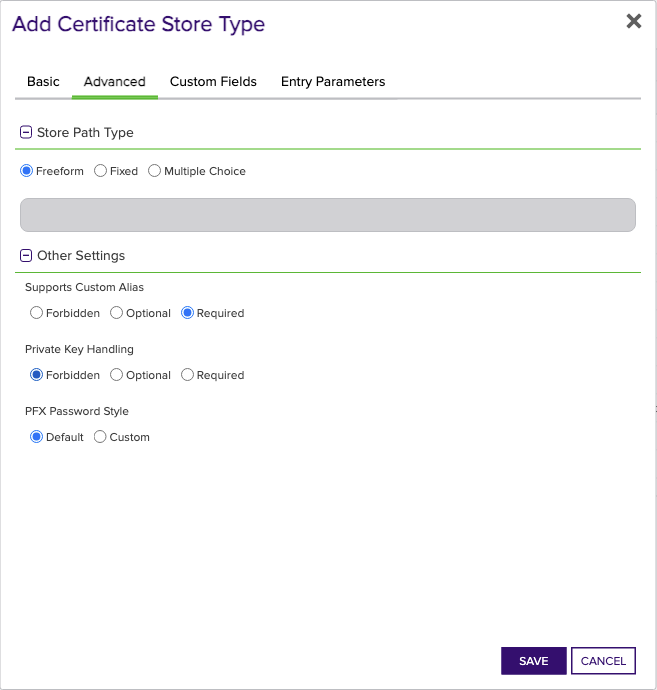

## F5 CA Profiles REST

TODO Overview is a required section


### Supported Job Types

| Job Name | Supported |
| -------- | --------- |
| Inventory | ✅ |
| Management Add | ✅ |
| Management Remove | ✅ |
| Discovery | ✅ |
| Create |  |
| Reenrollment |  |

## Requirements

TODO Requirements is a required section


## Certificate Store Type Configuration

The recommended method for creating the `F5-CA-REST` Certificate Store Type is to use [kfutil](https://github.com/Keyfactor/kfutil). After installing, use the following command to create the `F5-CA-REST` Certificate Store Type:

```shell
kfutil store-types create F5-CA-REST
```

<details><summary>F5-CA-REST</summary>

Create a store type called `F5-CA-REST` with the attributes in the tables below:

### Basic Tab
| Attribute | Value | Description |
| --------- | ----- | ----- |
| Name | F5 CA Profiles REST | Display name for the store type (may be customized) |
| Short Name | F5-CA-REST | Short display name for the store type |
| Capability | F5-CA-REST | Store type name orchestrator will register with. Check the box to allow entry of value |
| Supported Job Types (check the box for each) | Add, Discovery, Remove | Job types the extension supports |
| Supports Add | ✅ | Check the box. Indicates that the Store Type supports Management Add |
| Supports Remove | ✅ | Check the box. Indicates that the Store Type supports Management Remove |
| Supports Discovery | ✅ | Check the box. Indicates that the Store Type supports Discovery |
| Supports Reenrollment |  |  Indicates that the Store Type supports Reenrollment |
| Supports Create |  |  Indicates that the Store Type supports store creation |
| Needs Server | ✅ | Determines if a target server name is required when creating store |
| Blueprint Allowed | ✅ | Determines if store type may be included in an Orchestrator blueprint |
| Uses PowerShell |  | Determines if underlying implementation is PowerShell |
| Requires Store Password |  | Determines if a store password is required when configuring an individual store. |
| Supports Entry Password |  | Determines if an individual entry within a store can have a password. |

The Basic tab should look like this:


### Advanced Tab
| Attribute | Value | Description |
| --------- | ----- | ----- |
| Supports Custom Alias | Required | Determines if an individual entry within a store can have a custom Alias. |
| Private Key Handling | Forbidden | This determines if Keyfactor can send the private key associated with a certificate to the store. Required because IIS certificates without private keys would be invalid. |
| PFX Password Style | Default | 'Default' - PFX password is randomly generated, 'Custom' - PFX password may be specified when the enrollment job is created (Requires the Allow Custom Password application setting to be enabled.) |

The Advanced tab should look like this:



### Custom Fields Tab
Custom fields operate at the certificate store level and are used to control how the orchestrator connects to the remote target server containing the certificate store to be managed. The following custom fields should be added to the store type:

| Name | Display Name | Type | Default Value/Options | Required | Description |
| ---- | ------------ | ---- | --------------------- | -------- | ----------- |


The Custom Fields tab should look like this:


</details>


## Extension Mechanics

TODO Extension Mechanics is an optional section - if you don't need it, feel free to remove it. Refer to the docs on [Confluence](https://keyfactor.atlassian.net/wiki/x/SAAyHg) for more info


## Certificate Store Configuration

After creating the `F5-CA-REST` Certificate Store Type and installing the F5 REST Universal Orchestrator extension, you can create new [Certificate Stores](https://software.keyfactor.com/Core-OnPrem/Current/Content/ReferenceGuide/Certificate%20Stores.htm?Highlight=certificate%20store) to manage certificates in the remote platform.

The following table describes the required and optional fields for the `F5-CA-REST` certificate store type.

| Attribute | Description | Attribute is PAM Eligible |
| --------- | ----------- | ------------------------- |
| Category | Select "F5 CA Profiles REST" or the customized certificate store name from the previous step. | |
| Container | Optional container to associate certificate store with. | |
| Client Machine | The fully qualified domain name or IP address of the F5 device where the CA Profiles are managed. For example, 'f5.example.com' or '192.168.1.1'. | |
| Store Path | The name of the partition on the F5 device where the CA Profiles are managed, such as 'Common'. This value is case-sensitive. | |
| Orchestrator | Select an approved orchestrator capable of managing `F5-CA-REST` certificates. Specifically, one with the `F5-CA-REST` capability. | |

* **Using kfutil**

    ```shell
    # Generate a CSV template for the AzureApp certificate store
    kfutil stores import generate-template --store-type-name F5-CA-REST --outpath F5-CA-REST.csv

    # Open the CSV file and fill in the required fields for each certificate store.

    # Import the CSV file to create the certificate stores
    kfutil stores import csv --store-type-name F5-CA-REST --file F5-CA-REST.csv
    ```

* **Manually with the Command UI**: In Keyfactor Command, navigate to Certificate Stores from the Locations Menu. Click the Add button to create a new Certificate Store using the attributes in the table above.


## Test Cases

TODO Test Cases is an optional section - if you don't need it, feel free to remove it. Refer to the docs on [Confluence](https://keyfactor.atlassian.net/wiki/x/SAAyHg) for more info


