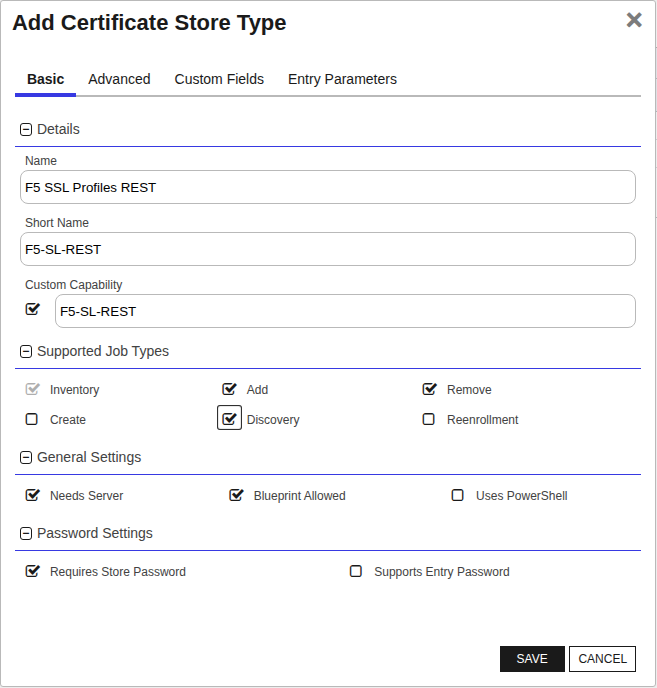
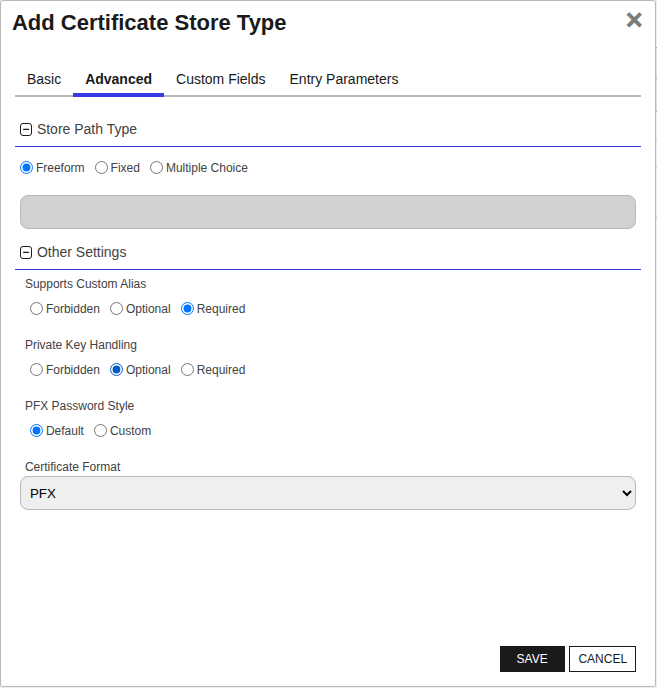
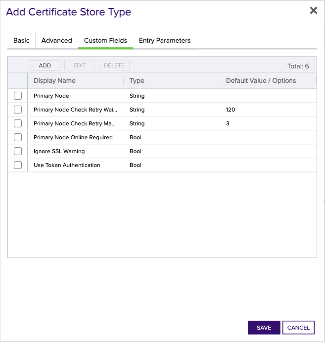

## F5 SSL Profiles REST

The F5 SSL Profiles REST Certificate Store Type is designed to manage SSL certificates on F5 devices that are used for SSL/TLS termination, ensuring secure communication. This certificate store type represents the SSL certificates configured on F5 devices, allowing for their discovery, inventory, and management, including adding and removing certificates.

One of the critical aspects of this store type is that it is assumed that SSL certificates have associated private keys, which are crucial for the SSL/TLS handshake process. During inventory tasks, the Keyfactor Command system will track whether a private key exists but will not actually retrieve the private key itself, as this is a convention used by F5 devices.

This certificate store type does not utilize an SDK but operates through REST APIs provided by F5 for communication and management tasks. A notable caveat is that the F5's API does not provide a mechanism to determine the presence of a private key, so the extension assumes that all SSL certificates have private keys.

Users should be aware of a couple of potential areas for confusion. First, SSL certificate management (Add operations) inherently involves replacing or renewing existing certificates while keeping the private key intact. This behavior might differ from typical certificate addition scenarios where new keys might be generated. Second, the `Ignore SSL Warnings` option needs careful consideration; enabling it will suppress SSL warnings, which might mask potential SSL configuration issues.


### Supported Job Types

| Job Name | Supported |
| -------- | --------- |
| Inventory | ✅ |
| Management Add | ✅ |
| Management Remove | ✅ |
| Discovery | ✅ |
| Create |  |
| Reenrollment |  |

## Requirements

### F5 Orchestrator Installation

1. Stop the Keyfactor Universal Orchestrator Service.
2. In the Keyfactor Orchestrator installation folder (by convention usually C:\Program Files\Keyfactor\Keyfactor Orchestrator), find the "extensions" folder. Underneath that, create a new folder named F5 or another name of your choosing.
3. Download the latest version of the F5 Orchestrator from [GitHub](https://github.com/Keyfactor/f5-rest-orchestrator).
4. Copy the contents of the download installation zip file into the folder created in step 1.
5. Start the Keyfactor Universal Orchestrator Service.

### F5 Orchestrator Configuration

**1. In Keyfactor Command, if any of the aforementioned certificate store types do not already exist, create a new certificate store type for each of the 3 that you wish to manage by navigating to Settings (the "gear" icon in the top right) => Certificate Store Types.**

**<u>CA Bundles:</u>**


**<u>Web Server Certificates</u>**


**<u>SSL Certificates</u>**


- **Name** – Required. The display name of the new Certificate Store Type
- **Short Name** – Required. This value ***must match*** the folder name for this store type under the "extensions" folder in the install path.
- **Custom Capability** - Leave unchecked
- **Supported Job Types** – Select Inventory and Add for all 3 types, and Discovery for CA Bundles and SSL Certificates.
- **General Settings** - Select Needs Server.  Leave Uses PowerShell unchecked.  Select Blueprint Allowed if you plan to use blueprinting.
- **Password Settings** - Leave both options unchecked
- **All selections on Advanced tab** - Set the values on this tab ***exactly*** as they are shown in the above screen prints for each applicable store type.


The Custom Fields tab contains 10 custom store parameters (3 of which, Server Username, Server Password, and Use SSL were set up on the Basic tab and are not actually custom parameters you need or want to modify on this tab).  The set up is consistent across store types, and should look as follows:

<br>  
<br>  
<br>  
<br>  
<br>  
<br>  
<br>  
<br>  

If any or all of the 3 certificate store types were already set up on installation of Keyfactor, you may only need to add Primary Node Online Required and Ignore SSL Warning.  These parameters, however, are optional and only necessary if needed to be set to true.  Please see the descriptions below in "2a. Create a F5 Certificate Store wihin Keyfactor Command.


**2a. Create a F5 Certificate Store within Keyfactor Command**  
  

If you choose to manually create a F5 store In Keyfactor Command rather than running a Discovery job (Step 2b) to automatically find the store, you can navigate to Certificate Locations =\> Certificate Stores within Keyfactor Command to add the store. Below are the values that should be entered.

- **Category** – Required.  One of the 3 F5 store types - F5 Web Server REST, F5 CA Bundles REST, or F5 SSL Profiles REST (your configured names may be different based on what you entered when creating the certificate store types in Step 1).

- **Container** – Optional.  Select a container if utilized.

- **Client Machine & Credentials** – Required.  The server name or IP Address and login credentials for the F5 device.  The credentials for server login can be any of:
  
  - UserId/Password
  
  - PAM provider information to pass the UserId/Password or UserId/SSH private key credentials
    
  When entering the credentials, UseSSL ***must*** be selected.
  
- **Store Path** – Required.  Enter the name of the partition on the F5 device you wish to manage.  This value is case sensitive, so if the partition name is "Common", it must be entered as "Common" and not "common".

- **Primary Node Online Required** – Optional.  Select this if you wish to stop the orchestrator from adding, replacing or renewing certificates on nodes that are inactive.  If this is not selected, adding, replacing and renewing certificates on inactive nodes will be allowed.  If you choose not to add this custom field, the default value of False will be assumed.

- **Primary Node** - Only required (and shown) if Primary Node Online Required is added and selected.  Enter the fully qualified domain name of the F5 device that acts as the primary node in a highly available F5 implementation.  If you're using a single F5 device, this will typically be the same value you entered in the Client Machine field.

- **Primary Node Check Retry Maximum** - Only required (and shown) if Primary Node Online Required is added and selected.  Enter the number of times a Management-Add job will attempt to add/replace/renew a certificate if the node is inactive before failing.

- **Primary Node Check Retry Wait Seconds** - Only required (and shown) if Primary Node Online Required is added and selected.  Enter the number of seconds to wait between attempts to add/replace/renew a certificate if the node is inactive.

- **Version of F5** - Required.  Select v13, v14, or v15 to match the version for the F5 device being managed

- **Ignore SSL Warning** - Optional.  Select this if you wish to ignore SSL warnings from F5 that occur during API calls when the site does not have a trusted certificate with the proper SAN bound to it.  If you choose not to add this custom field, the default value of False will be assumed and SSL warnings will cause errors during orchestrator extension jobs.

- **Use Token Authentication** - Optional.  Select this if you wish to use F5's token authentiation instead of basic authentication for all API requests.  If you choose not to add this custom field, the default value of False will be assumed and basic authentication will be used for all API requests for all jobs.  Setting this value to True will enable an initial basic authenticated request to acquire an authentication token, which will then be used for all subsequent API requests.

- **Orchestrator** – Required.  Select the orchestrator you wish to use to manage this store

- **Inventory Schedule** – Set a schedule for running Inventory jobs or none, if you choose not to schedule Inventory at this time.

**2b. (Optional) Schedule a F5 Discovery Job**

Rather than manually creating F5 certificate stores, you can schedule a Discovery job to search find them (CA Bundle and SSL Certificate store types only).

First, in Keyfactor Command navigate to Certificate Locations =\> Certificate Stores. Select the Discover tab and then the Schedule button. Complete the dialog and click Done to schedule.


- **Category** – Required. The F5 store type you wish to find stores for.

- **Orchestrator** – Select the orchestrator you wish to use to manage this store

- **Client Machine & Credentials** – Required.  The server name or IP Address and login credentials for the F5 device.  The credentials for server login can be any of:

  - UserId/Password
  - PAM provider information to pass the UserId/Password or UserId/SSH private key credentials
  
  When entering the credentials, UseSSL ***must*** be selected.
  
- **When** – Required. The date and time when you would like this to execute.

- **Directories to search** – Required but not used. This field is not used in the search to Discover certificate stores, but ***is*** a required field in this dialog, so just enter any value.  It will not be used.

- **Directories to ignore/Extensions/File name patterns to match/Follow SymLinks/Include PKCS12 Files** – Not used.  Leave blank.

Once the Discovery job has completed, a list of F5 certificate store locations should show in the Certificate Stores Discovery tab in Keyfactor Command. Right click on a store and select Approve to bring up a dialog that will ask for the remaining necessary certificate store parameters described in Step 2a.  Complete those and click Save, and the Certificate Store should now show up in the list of stores in the Certificate Stores tab.


## Certificate Store Type Configuration

The recommended method for creating the `F5-SL-REST` Certificate Store Type is to use [kfutil](https://github.com/Keyfactor/kfutil). After installing, use the following command to create the `` Certificate Store Type:

```shell
kfutil store-types create F5-SL-REST
```

<details><summary>F5-SL-REST</summary>

Create a store type called `F5-SL-REST` with the attributes in the tables below:

### Basic Tab
| Attribute | Value | Description |
| --------- | ----- | ----- |
| Name | F5 SSL Profiles REST | Display name for the store type (may be customized) |
| Short Name | F5-SL-REST | Short display name for the store type |
| Capability | F5-SL-REST | Store type name orchestrator will register with. Check the box to allow entry of value |
| Supported Job Types (check the box for each) | Add, Discovery, Remove | Job types the extension supports |
| Supports Add | ✅ | Check the box. Indicates that the Store Type supports Management Add |
| Supports Remove | ✅ | Check the box. Indicates that the Store Type supports Management Remove |
| Supports Discovery | ✅ | Check the box. Indicates that the Store Type supports Discovery |
| Supports Reenrollment |  |  Indicates that the Store Type supports Reenrollment |
| Supports Create |  |  Indicates that the Store Type supports store creation |
| Needs Server | ✅ | Determines if a target server name is required when creating store |
| Blueprint Allowed | ✅ | Determines if store type may be included in an Orchestrator blueprint |
| Uses PowerShell |  | Determines if underlying implementation is PowerShell |
| Requires Store Password |  | Determines if a store password is required when configuring an individual store. |
| Supports Entry Password |  | Determines if an individual entry within a store can have a password. |

The Basic tab should look like this:



### Advanced Tab
| Attribute | Value | Description |
| --------- | ----- | ----- |
| Supports Custom Alias | Required | Determines if an individual entry within a store can have a custom Alias. |
| Private Key Handling | Optional | This determines if Keyfactor can send the private key associated with a certificate to the store. Required because IIS certificates without private keys would be invalid. |
| PFX Password Style | Default | 'Default' - PFX password is randomly generated, 'Custom' - PFX password may be specified when the enrollment job is created (Requires the Allow Custom Password application setting to be enabled.) |

The Advanced tab should look like this:



### Custom Fields Tab
Custom fields operate at the certificate store level and are used to control how the orchestrator connects to the remote target server containing the certificate store to be managed. The following custom fields should be added to the store type:

| Name | Display Name | Type | Default Value/Options | Required | Description |
| ---- | ------------ | ---- | --------------------- | -------- | ----------- |


The Custom Fields tab should look like this:




</details>

## Certificate Store Configuration

After creating the `F5-SL-REST` Certificate Store Type and installing the F5 Universal Orchestrator extension, you can create new [Certificate Stores](https://software.keyfactor.com/Core-OnPrem/Current/Content/ReferenceGuide/Certificate%20Stores.htm?Highlight=certificate%20store) to manage certificates in the remote platform.

The following table describes the required and optional fields for the `F5-SL-REST` certificate store type.

| Attribute | Description | Attribute is PAM Eligible |
| --------- | ----------- | ------------------------- |
| Category | Select "F5 SSL Profiles REST" or the customized certificate store name from the previous step. | |
| Container | Optional container to associate certificate store with. | |
| Client Machine | For the Client Machine field, enter the server name or IP address of the F5 device you wish to manage. Ensure that the format is consistent, such as 'f5server.example.com' or '192.168.1.1'. | |
| Store Path | For the Store Path field, enter the name of the partition on the F5 device you wish to manage. This value is case-sensitive, so if the partition name is 'Common', it must be entered as 'Common' and not 'common'. | |
| Orchestrator | Select an approved orchestrator capable of managing `F5-SL-REST` certificates. Specifically, one with the `F5-SL-REST` capability. | |

* **Using kfutil**

    ```shell
    # Generate a CSV template for the AzureApp certificate store
    kfutil stores import generate-template --store-type-name F5-SL-REST --outpath F5-SL-REST.csv

    # Open the CSV file and fill in the required fields for each certificate store.

    # Import the CSV file to create the certificate stores
    kfutil stores import csv --store-type-name F5-SL-REST --file F5-SL-REST.csv
    ```

* **Manually with the Command UI**: In Keyfactor Command, navigate to Certificate Stores from the Locations Menu. Click the Add button to create a new Certificate Store using the attributes in the table above.